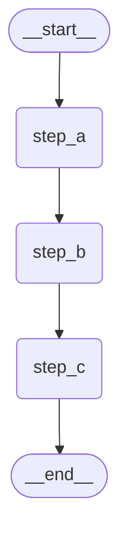

# 可视化理解

> 🎯 **学习目标**：掌握 LangGraph 图的可视化方法，学会通过图形化工具理解和调试复杂的工作流

## 👁️ 为什么需要可视化？

当你的 LangGraph 变得复杂时，仅仅阅读代码已经很难理解整个流程：

```python
# 😵 复杂的图结构 - 很难从代码理解流程
graph.add_conditional_edges("analyzer", route_func, {
    "search": "web_search",
    "data": "db_query",
    "api": "api_call"
})
graph.add_conditional_edges("web_search", check_results, {
    "success": "combiner",
    "retry": "analyzer"
})
# ... 更多连接
```

通过可视化，复杂的逻辑变得一目了然：

```
     ┌─────────┐
     │analyzer │
     └─────┬───┘
       ┌───┼───┐
  ┌────▼┐ ┌▼──┐ ┌▼────┐
  │search│ │data│ │api  │
  └────┬┘ └┬──┘ └┬────┘
       └───┼────┘
       ┌───▼───┐
       │combiner│
       └───────┘
```

## 🛠️ LangGraph 内置可视化

### 1. Mermaid 图表生成

LangGraph 提供了内置的 Mermaid 图表生成功能：

```python
from langgraph.graph import StateGraph, END
from typing import TypedDict

class SimpleState(TypedDict):
    message: str
    step: str

def step_a(state: SimpleState) -> SimpleState:
    return {"message": state["message"], "step": "A"}

def step_b(state: SimpleState) -> SimpleState:
    return {"message": state["message"], "step": "B"}

def step_c(state: SimpleState) -> SimpleState:
    return {"message": state["message"], "step": "C"}

# 构建图
graph = StateGraph(SimpleState)
graph.add_node("step_a", step_a)
graph.add_node("step_b", step_b)
graph.add_node("step_c", step_c)

graph.set_entry_point("step_a")
graph.add_edge("step_a", "step_b")
graph.add_edge("step_b", "step_c")
graph.add_edge("step_c", END)

app = graph.compile()

# 生成 Mermaid 图
print("=== Mermaid 图形描述 ===")
print(app.get_graph().draw_mermaid())
```

输出的 Mermaid 代码：


### 2. PNG 图片生成

如果你在 Jupyter Notebook 环境中：

```python
# 在 Jupyter Notebook 中显示图片
try:
    from IPython.display import Image, display

    # 直接显示图片
    display(Image(app.get_graph().draw_mermaid_png()))

except ImportError:
    print("需要安装 jupyter 和相关依赖：pip install jupyter")

# 保存图片到文件
try:
    with open("my_graph.png", "wb") as f:
        f.write(app.get_graph().draw_mermaid_png())
    print("图片已保存到 my_graph.png")
except Exception as e:
    print(f"保存图片失败：{e}")
```

### 3. ASCII 艺术可视化

对于简单场景，我们可以创建 ASCII 图：

```python
def print_ascii_graph(graph_structure):
    """打印 ASCII 风格的图结构"""
    print("📊 图结构可视化:")
    print("=" * 50)

    for step, (node, connections) in enumerate(graph_structure.items(), 1):
        # 打印当前节点
        print(f"  {step}. [{node}]")

        # 打印连接
        for connection in connections:
            if connection == "END":
                print(f"     └── 🏁 END")
            else:
                print(f"     ├── {connection}")

        if step < len(graph_structure):
            print("     │")

# 使用示例
simple_structure = {
    "入口点": ["数据处理"],
    "数据处理": ["验证", "清理"],
    "验证": ["汇总"],
    "清理": ["汇总"],
    "汇总": ["END"]
}

print_ascii_graph(simple_structure)
```

## 🎨 复杂图的可视化示例

### 条件分支图可视化

```python
from langgraph.graph import StateGraph, END
from typing import TypedDict

class ChatState(TypedDict):
    user_input: str
    intent: str
    response: str

def analyze_intent(state: ChatState) -> ChatState:
    user_input = state["user_input"].lower()

    if "天气" in user_input:
        intent = "weather"
    elif "时间" in user_input:
        intent = "time"
    elif "新闻" in user_input:
        intent = "news"
    else:
        intent = "chat"

    return {**state, "intent": intent}

def weather_handler(state: ChatState) -> ChatState:
    return {**state, "response": "今天天气晴朗，25°C"}

def time_handler(state: ChatState) -> ChatState:
    return {**state, "response": "现在是下午3:30"}

def news_handler(state: ChatState) -> ChatState:
    return {**state, "response": "今日要闻：科技创新达到新高度"}

def chat_handler(state: ChatState) -> ChatState:
    return {**state, "response": "很高兴和您聊天！"}

def route_by_intent(state: ChatState) -> str:
    intent_mapping = {
        "weather": "weather_handler",
        "time": "time_handler",
        "news": "news_handler",
        "chat": "chat_handler"
    }
    return intent_mapping.get(state["intent"], "chat_handler")

# 构建分支图
chat_graph = StateGraph(ChatState)
chat_graph.add_node("analyze", analyze_intent)
chat_graph.add_node("weather_handler", weather_handler)
chat_graph.add_node("time_handler", time_handler)
chat_graph.add_node("news_handler", news_handler)
chat_graph.add_node("chat_handler", chat_handler)

chat_graph.set_entry_point("analyze")
chat_graph.add_conditional_edges(
    "analyze",
    route_by_intent,
    {
        "weather_handler": "weather_handler",
        "time_handler": "time_handler",
        "news_handler": "news_handler",
        "chat_handler": "chat_handler"
    }
)

# 所有处理器指向结束
for handler in ["weather_handler", "time_handler", "news_handler", "chat_handler"]:
    chat_graph.add_edge(handler, END)

chat_app = chat_graph.compile()

# 可视化分支图
print("=== 聊天机器人分支图 ===")
print(chat_app.get_graph().draw_mermaid())
```

### 循环图可视化

```python
class RetryState(TypedDict):
    task: str
    attempts: int
    max_attempts: int
    success: bool
    result: str

def try_task(state: RetryState) -> RetryState:
    import random

    attempts = state["attempts"] + 1
    # 随着尝试次数增加，成功率提高
    success_rate = 0.2 + (attempts * 0.2)
    success = random.random() < success_rate

    if success:
        result = f"✅ 任务在第 {attempts} 次尝试成功"
    else:
        result = f"❌ 第 {attempts} 次尝试失败"

    return {
        **state,
        "attempts": attempts,
        "success": success,
        "result": result
    }

def should_retry(state: RetryState) -> str:
    if state["success"]:
        return "success"
    elif state["attempts"] >= state["max_attempts"]:
        return "give_up"
    else:
        return "retry"

def handle_success(state: RetryState) -> RetryState:
    return {**state, "result": f"🎉 {state['result']}"}

def handle_failure(state: RetryState) -> RetryState:
    return {**state, "result": f"💔 已达最大重试次数: {state['max_attempts']}"}

# 构建重试图
retry_graph = StateGraph(RetryState)
retry_graph.add_node("try_task", try_task)
retry_graph.add_node("success", handle_success)
retry_graph.add_node("give_up", handle_failure)

retry_graph.set_entry_point("try_task")
retry_graph.add_conditional_edges(
    "try_task",
    should_retry,
    {
        "success": "success",
        "give_up": "give_up",
        "retry": "try_task"  # 循环回自己
    }
)

retry_graph.add_edge("success", END)
retry_graph.add_edge("give_up", END)

retry_app = retry_graph.compile()

print("=== 重试循环图 ===")
print(retry_app.get_graph().draw_mermaid())
```

## 🔍 图执行流程可视化

### 实时状态追踪

```python
def create_execution_tracer():
    """创建执行追踪器"""
    execution_log = []

    def trace_execution(node_name: str, input_state: dict, output_state: dict):
        """追踪节点执行"""
        execution_log.append({
            "node": node_name,
            "input": input_state.copy(),
            "output": output_state.copy(),
            "timestamp": __import__('datetime').datetime.now()
        })

    def visualize_execution():
        """可视化执行流程"""
        print("\n🎬 图执行流程:")
        print("=" * 60)

        for i, log_entry in enumerate(execution_log, 1):
            node = log_entry["node"]
            timestamp = log_entry["timestamp"].strftime("%H:%M:%S.%f")[:-3]

            print(f"  {i}. 📍 [{timestamp}] 执行节点: {node}")

            # 显示状态变化
            input_state = log_entry["input"]
            output_state = log_entry["output"]

            for key in set(input_state.keys()) | set(output_state.keys()):
                old_val = input_state.get(key, "<无>")
                new_val = output_state.get(key, "<无>")

                if old_val != new_val:
                    print(f"      🔄 {key}: {old_val} → {new_val}")

            print()

    return trace_execution, visualize_execution, execution_log

# 使用追踪器
tracer, visualizer, log = create_execution_tracer()

# 带追踪的节点函数
def traced_node(node_name: str, func):
    """包装节点函数以支持追踪"""
    def wrapper(state):
        input_state = state.copy()
        output_state = func(state)
        tracer(node_name, input_state, output_state)
        return output_state
    return wrapper

# 示例：追踪聊天机器人执行
traced_analyze = traced_node("意图分析", analyze_intent)
traced_weather = traced_node("天气处理", weather_handler)

# 手动测试执行流程
test_state = {"user_input": "今天天气怎么样", "intent": "", "response": ""}

# 执行步骤1
test_state = traced_analyze(test_state)

# 执行步骤2（根据意图）
if test_state["intent"] == "weather":
    test_state = traced_weather(test_state)

# 显示执行过程
visualizer()
```

### 流程图生成器

```python
def generate_flow_diagram(execution_log: list) -> str:
    """根据执行日志生成流程图"""

    if not execution_log:
        return "空执行日志"

    diagram = ["流程执行图:", "=" * 40]

    for i, log_entry in enumerate(execution_log):
        node_name = log_entry["node"]

        if i == 0:
            # 第一个节点
            diagram.append(f"  🚀 开始")
            diagram.append(f"    ↓")
            diagram.append(f"  📦 {node_name}")
        else:
            diagram.append(f"    ↓")
            diagram.append(f"  📦 {node_name}")

    diagram.append(f"    ↓")
    diagram.append(f"  🏁 结束")

    return "\n".join(diagram)

# 生成并显示流程图
if log:
    print(generate_flow_diagram(log))
```

## 🎯 可视化最佳实践

### 1. 节点命名规范

```python
# ❌ 不好的命名
graph.add_node("n1", func1)
graph.add_node("process", func2)
graph.add_node("h", func3)

# ✅ 好的命名
graph.add_node("intent_analyzer", analyze_intent)
graph.add_node("weather_handler", handle_weather)
graph.add_node("response_formatter", format_response)
```

### 2. 分层可视化

对于复杂图，按功能分层展示：

```python
def print_layered_graph(graph_layers: dict):
    """分层显示图结构"""
    print("🏗️ 分层图结构:")
    print("=" * 50)

    for layer_name, nodes in graph_layers.items():
        print(f"\n📋 {layer_name} 层:")
        print("-" * 30)

        for node in nodes:
            print(f"  📦 {node}")

        print("  ↓ ↓ ↓")

# 示例分层
layers = {
    "输入处理": ["用户输入验证", "意图识别"],
    "业务逻辑": ["天气查询", "新闻获取", "聊天处理"],
    "输出格式化": ["响应格式化", "错误处理"]
}

print_layered_graph(layers)
```

### 3. 状态流可视化

```python
def visualize_state_flow(state_history: list):
    """可视化状态流转"""
    print("🌊 状态流转可视化:")
    print("=" * 50)

    for i, state in enumerate(state_history):
        print(f"  步骤 {i+1}:")

        for key, value in state.items():
            # 截断长值
            display_value = str(value)
            if len(display_value) > 30:
                display_value = display_value[:27] + "..."

            print(f"    📝 {key}: {display_value}")

        if i < len(state_history) - 1:
            print("    ⬇️")

        print()

# 使用示例
state_flow = [
    {"user_input": "今天天气怎么样", "intent": "", "response": ""},
    {"user_input": "今天天气怎么样", "intent": "weather", "response": ""},
    {"user_input": "今天天气怎么样", "intent": "weather", "response": "今天天气晴朗，25°C"}
]

visualize_state_flow(state_flow)
```

## 🔧 调试可视化工具

### 断点可视化

```python
def create_debug_visualizer():
    """创建调试可视化工具"""
    breakpoints = set()

    def add_breakpoint(node_name: str):
        """添加断点"""
        breakpoints.add(node_name)
        print(f"🔴 在节点 '{node_name}' 设置断点")

    def debug_node(node_name: str, state: dict):
        """调试节点"""
        if node_name in breakpoints:
            print(f"\n🛑 断点触发: {node_name}")
            print("📊 当前状态:")

            for key, value in state.items():
                print(f"  {key}: {value}")

            input("按 Enter 继续执行...")

    return add_breakpoint, debug_node

# 使用调试器
add_bp, debug = create_debug_visualizer()

# 设置断点
add_bp("intent_analyzer")
add_bp("weather_handler")

# 在节点中使用
def debuggable_node(node_name: str, func):
    """可调试的节点"""
    def wrapper(state):
        debug(node_name, state)
        return func(state)
    return wrapper
```

## 🎪 实践练习

### 练习 1：可视化你的第一个图

创建一个简单的图并生成其可视化：

```python
# 创建一个包含条件分支的简单图
# 然后使用不同的可视化方法展示它
```

### 练习 2：执行追踪器

为 `Graphs/` 目录中的某个 notebook 添加执行追踪功能，观察状态变化过程。

### 练习 3：复杂图简化

如果你有一个复杂的图，尝试将其分层展示，使结构更清晰。

## 🔍 可视化工具对比

| 工具 | 优点 | 缺点 | 适用场景 |
|------|------|------|----------|
| Mermaid | 专业、美观 | 需要额外工具渲染 | 文档、展示 |
| ASCII | 简单、直接 | 表达能力有限 | 快速调试 |
| 执行追踪 | 动态、详细 | 输出冗长 | 深度调试 |
| 分层展示 | 结构清晰 | 需要手动整理 | 复杂图理解 |

## 💡 关键要点

1. **可视化是理解的桥梁**：复杂图必须通过可视化才能直观理解
2. **选择合适的工具**：根据场景选择最适合的可视化方法
3. **命名很重要**：清晰的节点命名让图更易读
4. **分层思考**：复杂图通过分层展示更容易理解
5. **调试友好**：好的可视化工具能大大提高调试效率

## 🚀 下一步

掌握可视化技巧后，接下来学习：
- `../03-LangGraph基础/01-为什么需要LangGraph.md` - 开始实战学习
- 在实际项目中应用这些可视化技巧

---

*现在你已经掌握了可视化 LangGraph 的各种技巧，复杂的图结构再也不会让你困惑！* 🎉