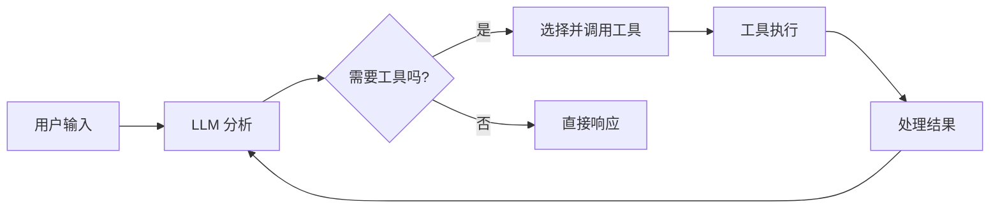

# Tool 定义与使用

## 概述

在 LangGraph 中，Tool（工具）是 AI Agent 与外部世界交互的桥梁。通过工具，Agent 可以获取实时信息、执行计算、操作数据库、调用 API 等。本文档将详细介绍如何定义、配置和使用工具。

## 工具的核心概念

### 什么是工具？

工具是带有明确输入输出规范的函数，它们：
- 具有描述性的名称和说明
- 定义了明确的输入参数
- 返回结构化的结果
- 可以被 LLM 通过 Tool Calling 机制调用

### 工具在 Agent 中的作用



## 基础工具定义

### 使用 @tool 装饰器

最简单的工具定义方式：

```python
from langchain_core.tools import tool

@tool
def calculate_area(length: float, width: float) -> float:
    """计算矩形面积

    Args:
        length: 矩形的长度
        width: 矩形的宽度

    Returns:
        矩形的面积
    """
    return length * width

# 查看工具信息
print(f"工具名称: {calculate_area.name}")
print(f"工具描述: {calculate_area.description}")
print(f"工具参数: {calculate_area.args}")
```

### 高级参数配置

```python
from typing import Optional
from langchain_core.tools import tool

@tool(
    name="advanced_calculator",
    description="执行高级数学计算，支持多种运算模式"
)
def advanced_calculator(
    operation: str,
    x: float,
    y: Optional[float] = None,
    precision: int = 2
) -> dict:
    """高级计算器工具

    Args:
        operation: 运算类型 ('add', 'multiply', 'power', 'sqrt')
        x: 第一个数值
        y: 第二个数值（某些运算需要）
        precision: 结果精度（小数位数）

    Returns:
        包含计算结果和元信息的字典
    """
    import math

    result = None

    if operation == "add" and y is not None:
        result = x + y
    elif operation == "multiply" and y is not None:
        result = x * y
    elif operation == "power" and y is not None:
        result = pow(x, y)
    elif operation == "sqrt":
        result = math.sqrt(x)
    else:
        return {"error": f"不支持的运算类型: {operation}"}

    return {
        "result": round(result, precision),
        "operation": operation,
        "inputs": {"x": x, "y": y},
        "precision": precision
    }
```

## 使用 BaseTool 类创建复杂工具

### 基础 BaseTool 实现

```python
from langchain_core.tools import BaseTool
from pydantic import Field
from typing import Type

class WeatherTool(BaseTool):
    name: str = "get_weather"
    description: str = "获取指定城市的天气信息"

    def _run(self, city: str) -> dict:
        """执行工具的主要逻辑"""
        # 模拟天气 API 调用
        mock_weather = {
            "北京": {"temperature": 15, "condition": "多云", "humidity": 65},
            "上海": {"temperature": 20, "condition": "晴天", "humidity": 55},
            "广州": {"temperature": 25, "condition": "小雨", "humidity": 80}
        }

        weather = mock_weather.get(city, {
            "temperature": 18,
            "condition": "未知",
            "humidity": 60
        })

        return {
            "city": city,
            "temperature": weather["temperature"],
            "condition": weather["condition"],
            "humidity": weather["humidity"],
            "timestamp": "2024-01-15 10:30:00"
        }

    async def _arun(self, city: str) -> dict:
        """异步版本的工具执行"""
        # 对于真实的异步操作，这里会使用 aiohttp 等
        return self._run(city)

# 使用工具
weather_tool = WeatherTool()
result = weather_tool.run("北京")
print(result)
```

### 带参数验证的 BaseTool

```python
from pydantic import BaseModel, Field, validator
from langchain_core.tools import BaseTool
from typing import Optional

class DatabaseQueryInput(BaseModel):
    """数据库查询工具的输入模型"""
    query: str = Field(description="SQL 查询语句")
    table: str = Field(description="目标表名")
    limit: Optional[int] = Field(default=10, description="结果数量限制")

    @validator('query')
    def validate_query(cls, v):
        """验证 SQL 查询的安全性"""
        dangerous_keywords = ['DROP', 'DELETE', 'UPDATE', 'INSERT']
        if any(keyword in v.upper() for keyword in dangerous_keywords):
            raise ValueError(f"不允许执行危险的 SQL 操作")
        return v

    @validator('limit')
    def validate_limit(cls, v):
        if v and (v < 1 or v > 1000):
            raise ValueError("查询结果数量限制必须在 1-1000 之间")
        return v

class DatabaseQueryTool(BaseTool):
    name: str = "database_query"
    description: str = "安全地查询数据库并返回结果"
    args_schema: Type[BaseModel] = DatabaseQueryInput

    def _run(self, query: str, table: str, limit: int = 10) -> dict:
        """执行数据库查询"""
        # 模拟数据库查询
        mock_data = {
            "users": [
                {"id": 1, "name": "张三", "age": 25},
                {"id": 2, "name": "李四", "age": 30},
                {"id": 3, "name": "王五", "age": 28}
            ],
            "products": [
                {"id": 1, "name": "笔记本电脑", "price": 5999},
                {"id": 2, "name": "鼠标", "price": 99}
            ]
        }

        data = mock_data.get(table, [])
        limited_data = data[:limit] if data else []

        return {
            "query": query,
            "table": table,
            "count": len(limited_data),
            "data": limited_data,
            "execution_time": "0.05s"
        }

# 使用带验证的工具
db_tool = DatabaseQueryTool()

# 正常查询
result = db_tool.run(
    query="SELECT * FROM users WHERE age > 25",
    table="users",
    limit=5
)
print("查询结果:", result)

# 尝试危险查询（会抛出验证错误）
try:
    dangerous_result = db_tool.run(
        query="DROP TABLE users",
        table="users"
    )
except Exception as e:
    print(f"验证错误: {e}")
```

## 工具的错误处理

### 基本错误处理模式

```python
from langchain_core.tools import tool
from typing import Union

@tool
def divide_numbers(dividend: float, divisor: float) -> Union[float, str]:
    """安全的除法运算

    Args:
        dividend: 被除数
        divisor: 除数

    Returns:
        计算结果或错误信息
    """
    try:
        if divisor == 0:
            return "错误: 除数不能为零"

        result = dividend / divisor
        return round(result, 4)

    except Exception as e:
        return f"计算错误: {str(e)}"

# 测试错误处理
print(divide_numbers(10, 2))    # 正常: 5.0
print(divide_numbers(10, 0))    # 错误处理: 错误: 除数不能为零
```

### 高级错误处理和重试机制

```python
import time
import random
from langchain_core.tools import BaseTool
from typing import Any, Optional

class ResilientAPITool(BaseTool):
    name: str = "resilient_api_call"
    description: str = "具有重试机制的 API 调用工具"

    def __init__(self, max_retries: int = 3, retry_delay: float = 1.0):
        super().__init__()
        self.max_retries = max_retries
        self.retry_delay = retry_delay

    def _simulate_api_call(self, endpoint: str) -> dict:
        """模拟不稳定的 API 调用"""
        # 30% 的概率失败
        if random.random() < 0.3:
            raise Exception("API 暂时不可用")

        return {
            "endpoint": endpoint,
            "data": f"来自 {endpoint} 的数据",
            "timestamp": time.time()
        }

    def _run(self, endpoint: str) -> dict:
        """带重试机制的工具执行"""
        last_error = None

        for attempt in range(self.max_retries + 1):
            try:
                result = self._simulate_api_call(endpoint)
                if attempt > 0:
                    result["retries"] = attempt
                return result

            except Exception as e:
                last_error = e
                if attempt < self.max_retries:
                    print(f"第 {attempt + 1} 次尝试失败，{self.retry_delay}秒后重试...")
                    time.sleep(self.retry_delay)
                    # 指数退避
                    self.retry_delay *= 1.5
                else:
                    break

        return {
            "error": f"API 调用失败，已重试 {self.max_retries} 次",
            "last_error": str(last_error),
            "endpoint": endpoint
        }

# 使用具有重试机制的工具
resilient_tool = ResilientAPITool(max_retries=2, retry_delay=0.5)
result = resilient_tool.run("https://api.example.com/data")
print(result)
```

## 访问状态和配置

### 在工具中访问 Agent 状态

```python
from langchain_core.tools import BaseTool
from typing import Any, Dict

class StatefulTool(BaseTool):
    name: str = "stateful_processor"
    description: str = "可以访问 Agent 状态的工具"

    def _run(self, operation: str, **kwargs) -> dict:
        """执行需要状态信息的操作"""
        # 获取配置信息
        config = kwargs.get('config', {})
        user_id = config.get('configurable', {}).get('user_id', 'anonymous')
        session_id = config.get('configurable', {}).get('session_id', 'default')

        # 模拟基于用户的个性化处理
        user_preferences = {
            "user123": {"language": "zh", "format": "detailed"},
            "user456": {"language": "en", "format": "simple"}
        }

        preferences = user_preferences.get(user_id, {"language": "zh", "format": "simple"})

        result = {
            "operation": operation,
            "user_id": user_id,
            "session_id": session_id,
            "preferences": preferences,
            "processed_at": time.time()
        }

        if operation == "get_summary":
            if preferences["format"] == "detailed":
                result["summary"] = "这是一个详细的摘要信息..."
            else:
                result["summary"] = "简要摘要"

        return result

# 在 Graph 中使用状态感知工具
def create_stateful_graph():
    from langgraph.graph import StateGraph
    from typing import TypedDict

    class AgentState(TypedDict):
        messages: list
        user_context: dict

    def tool_node(state: AgentState):
        """使用状态感知工具的节点"""
        tool = StatefulTool()

        # 传递配置信息
        config = {
            'configurable': {
                'user_id': state.get('user_context', {}).get('user_id', 'anonymous'),
                'session_id': state.get('user_context', {}).get('session_id', 'default')
            }
        }

        result = tool.run("get_summary", config=config)

        return {
            **state,
            "messages": state["messages"] + [f"工具执行结果: {result}"]
        }

    graph = StateGraph(AgentState)
    graph.add_node("tool_processor", tool_node)
    graph.set_entry_point("tool_processor")
    graph.set_finish_point("tool_processor")

    return graph.compile()
```

## 预构建工具集成

### 使用 LangChain 社区工具

```python
# 安装必要的包
# pip install langchain-community

from langchain_community.tools import DuckDuckGoSearchRun
from langchain_community.tools import WikipediaQueryRun
from langchain_community.utilities import WikipediaAPIWrapper

def create_search_tools():
    """创建搜索工具集合"""

    # DuckDuckGo 搜索
    search_tool = DuckDuckGoSearchRun()

    # Wikipedia 搜索
    wikipedia = WikipediaQueryRun(api_wrapper=WikipediaAPIWrapper())

    tools = [search_tool, wikipedia]

    return tools

# 使用预构建工具
tools = create_search_tools()

# 搜索信息
search_result = tools[0].run("LangGraph 是什么")
wiki_result = tools[1].run("人工智能")

print("搜索结果:", search_result[:200] + "...")
print("维基百科结果:", wiki_result[:200] + "...")
```

### 创建自定义工具集合

```python
from langchain_core.tools import tool
from typing import List

class ToolCollection:
    """工具集合管理器"""

    def __init__(self):
        self.tools = []
        self._register_tools()

    def _register_tools(self):
        """注册所有可用工具"""
        self.tools.extend([
            self.create_math_tools(),
            self.create_text_tools(),
            self.create_data_tools()
        ])
        self.tools = [tool for sublist in self.tools for tool in sublist]  # 扁平化

    def create_math_tools(self) -> List:
        """创建数学计算工具"""

        @tool
        def add(x: float, y: float) -> float:
            """两数相加"""
            return x + y

        @tool
        def multiply(x: float, y: float) -> float:
            """两数相乘"""
            return x * y

        return [add, multiply]

    def create_text_tools(self) -> List:
        """创建文本处理工具"""

        @tool
        def count_words(text: str) -> int:
            """统计文本中的单词数量"""
            return len(text.split())

        @tool
        def reverse_text(text: str) -> str:
            """反转文本"""
            return text[::-1]

        return [count_words, reverse_text]

    def create_data_tools(self) -> List:
        """创建数据处理工具"""

        @tool
        def calculate_average(numbers: List[float]) -> float:
            """计算数字列表的平均值"""
            if not numbers:
                return 0
            return sum(numbers) / len(numbers)

        return [calculate_average]

    def get_tool_by_name(self, name: str):
        """根据名称获取工具"""
        for tool in self.tools:
            if tool.name == name:
                return tool
        return None

    def list_available_tools(self) -> List[dict]:
        """列出所有可用工具"""
        return [
            {
                "name": tool.name,
                "description": tool.description,
                "args": tool.args
            }
            for tool in self.tools
        ]

# 使用工具集合
tool_collection = ToolCollection()

# 列出所有工具
print("可用工具:")
for tool_info in tool_collection.list_available_tools():
    print(f"- {tool_info['name']}: {tool_info['description']}")

# 使用特定工具
add_tool = tool_collection.get_tool_by_name("add")
if add_tool:
    result = add_tool.run(x=5, y=3)
    print(f"5 + 3 = {result}")
```

## 最佳实践

### 1. 工具设计原则

- **单一职责**: 每个工具只做一件事
- **清晰命名**: 使用描述性的名称
- **详细文档**: 提供完整的参数说明
- **错误处理**: 优雅地处理异常情况
- **幂等性**: 相同输入应产生相同输出

### 2. 性能优化

```python
from functools import lru_cache
from langchain_core.tools import tool

@tool
def expensive_computation(n: int) -> int:
    """执行复杂计算（带缓存）"""
    @lru_cache(maxsize=128)
    def _fibonacci(n: int) -> int:
        if n <= 1:
            return n
        return _fibonacci(n-1) + _fibonacci(n-2)

    return _fibonacci(n)
```

### 3. 安全考虑

```python
import re
from langchain_core.tools import tool

@tool
def safe_file_reader(filename: str) -> str:
    """安全的文件读取工具"""
    # 验证文件路径
    if not re.match(r'^[a-zA-Z0-9_\-./]+$', filename):
        return "错误: 文件名包含非法字符"

    # 限制文件类型
    allowed_extensions = ['.txt', '.md', '.json', '.csv']
    if not any(filename.endswith(ext) for ext in allowed_extensions):
        return "错误: 不支持的文件类型"

    # 防止路径遍历攻击
    if '..' in filename or filename.startswith('/'):
        return "错误: 非法的文件路径"

    try:
        with open(filename, 'r', encoding='utf-8') as f:
            content = f.read(1000)  # 限制读取大小
            return content
    except FileNotFoundError:
        return "错误: 文件不存在"
    except Exception as e:
        return f"错误: {str(e)}"
```

## 总结

工具是 LangGraph Agent 的重要组成部分，正确的工具设计和使用能显著提升 Agent 的能力。关键要点：

1. **选择合适的定义方式**: 简单工具用 `@tool`，复杂工具用 `BaseTool`
2. **重视错误处理**: 预期并处理各种异常情况
3. **优化性能**: 使用缓存、异步等技术
4. **保证安全**: 验证输入、限制权限、防止攻击
5. **文档完善**: 清晰的描述有助于 LLM 正确使用工具

在下一章节，我们将学习如何集成和配置不同的 LLM 模型来使用这些工具。