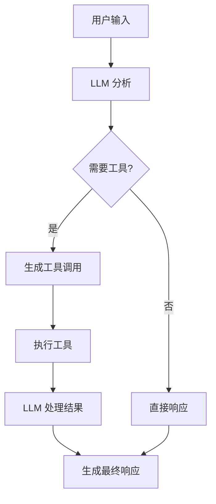

# LLM 集成

## 概述

在 LangGraph 中，LLM（Large Language Model）是 Agent 的核心大脑，负责理解用户意图、选择合适的工具、处理结果并生成响应。本文档将详细介绍如何配置和集成各种 LLM 模型，以及如何优化其在 LangGraph 中的使用。

## LLM 在 LangGraph 中的作用

### 核心功能

1. **意图理解**: 分析用户输入，理解需求
2. **工具选择**: 决定是否需要调用工具以及调用哪个工具
3. **参数生成**: 为工具调用生成正确的参数
4. **结果综合**: 整合工具输出，生成最终响应
5. **对话维持**: 保持上下文连贯性

### 工作流程



## 支持的 LLM 提供商

### OpenAI

```python
from langchain_openai import ChatOpenAI

# 基础配置
def create_openai_model():
    """创建 OpenAI 模型"""
    return ChatOpenAI(
        model="gpt-4",
        temperature=0.1,
        max_tokens=1000,
        timeout=30,
        max_retries=2,
        api_key="your-api-key"  # 或通过环境变量 OPENAI_API_KEY
    )

# 高级配置
def create_advanced_openai_model():
    """创建高级配置的 OpenAI 模型"""
    return ChatOpenAI(
        model="gpt-4-turbo-preview",
        temperature=0.2,
        max_tokens=2000,
        model_kwargs={
            "frequency_penalty": 0.1,
            "presence_penalty": 0.1,
            "top_p": 0.9
        },
        streaming=True,  # 启用流式输出
        verbose=True
    )

# 模型选择指南
MODEL_COMPARISON = {
    "gpt-3.5-turbo": {
        "cost": "低",
        "speed": "快",
        "capability": "基础",
        "use_case": "简单对话、基础任务"
    },
    "gpt-4": {
        "cost": "中",
        "speed": "中",
        "capability": "强",
        "use_case": "复杂推理、编程任务"
    },
    "gpt-4-turbo-preview": {
        "cost": "中高",
        "speed": "较快",
        "capability": "最强",
        "use_case": "复杂多步骤任务、长文本处理"
    }
}
```

### Anthropic Claude

```python
from langchain_anthropic import ChatAnthropic

def create_claude_model():
    """创建 Anthropic Claude 模型"""
    return ChatAnthropic(
        model="claude-3-sonnet-20240229",
        max_tokens=1000,
        temperature=0.1,
        anthropic_api_key="your-api-key"  # 或环境变量 ANTHROPIC_API_KEY
    )

def create_claude_haiku():
    """创建快速的 Claude Haiku 模型"""
    return ChatAnthropic(
        model="claude-3-haiku-20240307",
        max_tokens=2000,
        temperature=0,
        timeout=15
    )

def create_claude_opus():
    """创建最强的 Claude Opus 模型"""
    return ChatAnthropic(
        model="claude-3-opus-20240229",
        max_tokens=4000,
        temperature=0.1,
        system="你是一个专业的 AI 助手，专门帮助用户解决复杂问题。"
    )
```

### Azure OpenAI

```python
from langchain_openai import AzureChatOpenAI

def create_azure_model():
    """创建 Azure OpenAI 模型"""
    return AzureChatOpenAI(
        azure_endpoint="https://your-resource.openai.azure.com/",
        api_key="your-azure-api-key",
        api_version="2023-12-01-preview",
        deployment_name="gpt-4",  # 你的部署名称
        temperature=0.1,
        max_tokens=1000
    )

def create_azure_with_managed_identity():
    """使用托管身份的 Azure 配置"""
    from azure.identity import DefaultAzureCredential

    credential = DefaultAzureCredential()

    return AzureChatOpenAI(
        azure_endpoint="https://your-resource.openai.azure.com/",
        azure_ad_token_provider=credential,
        api_version="2023-12-01-preview",
        deployment_name="gpt-4",
        temperature=0.1
    )
```

### Google Gemini

```python
from langchain_google_genai import ChatGoogleGenerativeAI

def create_gemini_model():
    """创建 Google Gemini 模型"""
    return ChatGoogleGenerativeAI(
        model="gemini-pro",
        google_api_key="your-google-api-key",
        temperature=0.1,
        max_output_tokens=1000,
        convert_system_message_to_human=True
    )

def create_gemini_vision():
    """创建支持视觉的 Gemini 模型"""
    return ChatGoogleGenerativeAI(
        model="gemini-pro-vision",
        google_api_key="your-google-api-key",
        temperature=0.1
    )
```

### AWS Bedrock

```python
from langchain_aws import ChatBedrock

def create_bedrock_claude():
    """创建 AWS Bedrock 上的 Claude 模型"""
    return ChatBedrock(
        model_id="anthropic.claude-3-sonnet-20240229-v1:0",
        region_name="us-east-1",
        model_kwargs={
            "max_tokens": 1000,
            "temperature": 0.1,
            "top_p": 0.9
        }
    )

def create_bedrock_titan():
    """创建 AWS Bedrock 上的 Titan 模型"""
    return ChatBedrock(
        model_id="amazon.titan-text-express-v1",
        region_name="us-east-1",
        model_kwargs={
            "maxTokenCount": 1000,
            "temperature": 0.1
        }
    )
```

## Tool Calling 机制

### 什么是 Tool Calling

Tool Calling（工具调用）是现代 LLM 的核心功能，允许模型在需要时调用外部工具获取信息或执行操作。

### 基础 Tool Calling 示例

```python
from langchain_openai import ChatOpenAI
from langchain_core.tools import tool
from langchain_core.messages import HumanMessage, ToolMessage

# 定义工具
@tool
def get_current_weather(location: str) -> str:
    """获取指定位置的当前天气"""
    # 模拟天气 API
    weather_data = {
        "北京": "晴天，15°C",
        "上海": "多云，18°C",
        "广州": "小雨，22°C"
    }
    return weather_data.get(location, "天气信息不可用")

@tool
def calculate_distance(city1: str, city2: str) -> str:
    """计算两个城市之间的距离"""
    # 模拟距离计算
    distances = {
        ("北京", "上海"): "1213公里",
        ("北京", "广州"): "2129公里",
        ("上海", "广州"): "1247公里"
    }
    key = (city1, city2) if (city1, city2) in distances else (city2, city1)
    return distances.get(key, "距离信息不可用")

# 配置带工具的模型
def create_model_with_tools():
    """创建配置了工具的模型"""
    model = ChatOpenAI(model="gpt-4", temperature=0)
    tools = [get_current_weather, calculate_distance]

    # 绑定工具到模型
    model_with_tools = model.bind_tools(tools)
    return model_with_tools

# 使用工具
def demonstrate_tool_calling():
    """演示工具调用过程"""
    model = create_model_with_tools()

    # 用户查询
    messages = [HumanMessage(content="北京今天天气怎么样？")]

    # 模型响应（可能包含工具调用）
    response = model.invoke(messages)
    print(f"模型响应: {response}")

    # 检查是否有工具调用
    if response.tool_calls:
        print(f"工具调用: {response.tool_calls}")

        # 执行工具调用
        for tool_call in response.tool_calls:
            tool_name = tool_call["name"]
            tool_args = tool_call["args"]

            if tool_name == "get_current_weather":
                result = get_current_weather.invoke(tool_args)
            elif tool_name == "calculate_distance":
                result = calculate_distance.invoke(tool_args)
            else:
                result = "未知工具"

            print(f"工具 {tool_name} 执行结果: {result}")

            # 将工具结果添加到对话中
            messages.append(ToolMessage(
                content=result,
                tool_call_id=tool_call["id"]
            ))

        # 获取最终响应
        final_response = model.invoke(messages)
        print(f"最终响应: {final_response.content}")

# 运行演示
demonstrate_tool_calling()
```

### 高级 Tool Calling 配置

```python
from langchain_openai import ChatOpenAI
from langchain_core.tools import tool
from langchain_core.prompts import ChatPromptTemplate
from langchain_core.runnables import RunnablePassthrough
from typing import Literal

# 工具选择配置
def create_model_with_tool_choice():
    """创建具有工具选择策略的模型"""

    @tool
    def search_web(query: str) -> str:
        """搜索网络信息"""
        return f"搜索结果: {query} 的相关信息"

    @tool
    def get_weather(location: str) -> str:
        """获取天气信息"""
        return f"{location} 的天气信息"

    model = ChatOpenAI(model="gpt-4", temperature=0)
    tools = [search_web, get_weather]

    # 不同的工具调用策略
    strategies = {
        "auto": model.bind_tools(tools),  # 自动选择
        "required": model.bind_tools(tools, tool_choice="required"),  # 必须使用工具
        "none": model.bind_tools(tools, tool_choice="none"),  # 不使用工具
        "specific": model.bind_tools(tools, tool_choice={"type": "function", "function": {"name": "get_weather"}})  # 指定工具
    }

    return strategies

# 并行工具调用
def demonstrate_parallel_tool_calling():
    """演示并行工具调用"""

    @tool
    def get_weather(city: str) -> str:
        """获取城市天气"""
        return f"{city}: 晴天, 20°C"

    @tool
    def get_population(city: str) -> str:
        """获取城市人口"""
        populations = {
            "北京": "2154万",
            "上海": "2487万",
            "广州": "1881万"
        }
        return f"{city}: {populations.get(city, '未知')}"

    model = ChatOpenAI(model="gpt-4", temperature=0)
    model_with_tools = model.bind_tools([get_weather, get_population])

    # 请求多个城市的信息
    response = model_with_tools.invoke([
        HumanMessage(content="请告诉我北京和上海的天气和人口信息")
    ])

    print(f"并行工具调用: {len(response.tool_calls)} 个工具")
    for tool_call in response.tool_calls:
        print(f"- {tool_call['name']}: {tool_call['args']}")
```

## 模型配置优化

### 温度和随机性控制

```python
def compare_temperature_settings():
    """比较不同温度设置的效果"""

    models = {
        "保守型": ChatOpenAI(model="gpt-4", temperature=0),      # 确定性输出
        "平衡型": ChatOpenAI(model="gpt-4", temperature=0.3),    # 轻微创意
        "创意型": ChatOpenAI(model="gpt-4", temperature=0.7),    # 更多创意
        "随机型": ChatOpenAI(model="gpt-4", temperature=1.0)     # 高度随机
    }

    prompt = "用一句话描述人工智能的未来"

    results = {}
    for name, model in models.items():
        response = model.invoke([HumanMessage(content=prompt)])
        results[name] = response.content

    return results

# 输出长度控制
def configure_output_length():
    """配置输出长度"""

    models = {
        "简短": ChatOpenAI(model="gpt-4", max_tokens=50),
        "中等": ChatOpenAI(model="gpt-4", max_tokens=200),
        "详细": ChatOpenAI(model="gpt-4", max_tokens=500)
    }

    return models

# 高级参数配置
def create_optimized_model():
    """创建优化配置的模型"""
    return ChatOpenAI(
        model="gpt-4",
        temperature=0.1,           # 低随机性
        max_tokens=1500,           # 适中的输出长度
        top_p=0.9,                # 核采样
        frequency_penalty=0.1,     # 减少重复
        presence_penalty=0.1,      # 鼓励新话题
        timeout=30,                # 超时设置
        max_retries=2,             # 重试次数
        request_timeout=60,        # 请求超时
        streaming=True             # 流式输出
    )
```

### 系统提示词配置

```python
from langchain_core.prompts import ChatPromptTemplate, SystemMessagePromptTemplate

def create_system_prompt_configurations():
    """创建不同的系统提示词配置"""

    # 角色定义型
    role_prompt = ChatPromptTemplate.from_messages([
        ("system", """你是一个专业的 Python 开发助手。你的任务是：
        1. 帮助用户解决 Python 编程问题
        2. 提供清晰、简洁的代码示例
        3. 解释代码的工作原理
        4. 推荐最佳实践

        请始终保持专业、友好的语调，并确保代码的正确性和可读性。"""),
        ("human", "{input}")
    ])

    # 行为指导型
    behavior_prompt = ChatPromptTemplate.from_messages([
        ("system", """在回答问题时，请遵循以下步骤：
        1. 首先分析用户的需求
        2. 如果需要更多信息，主动询问
        3. 提供解决方案时，先给出思路，再给出具体实现
        4. 如果有多种解决方案，比较它们的优缺点
        5. 最后总结关键要点

        始终使用简体中文回答，保持逻辑清晰。"""),
        ("human", "{input}")
    ])

    # 限制型
    constraint_prompt = ChatPromptTemplate.from_messages([
        ("system", """重要约束条件：
        - 只回答与编程相关的问题
        - 不讨论政治、宗教或敏感话题
        - 代码示例必须经过验证
        - 回答长度控制在 500 字以内
        - 如果不确定答案，明确说明不知道"""),
        ("human", "{input}")
    ])

    return {
        "role_based": role_prompt,
        "behavior_guided": behavior_prompt,
        "constrained": constraint_prompt
    }

# 动态系统提示词
def create_dynamic_system_prompt():
    """创建动态系统提示词"""

    def get_system_prompt(user_type: str, task_type: str) -> str:
        """根据用户类型和任务类型生成系统提示词"""

        user_contexts = {
            "beginner": "你正在帮助编程初学者，需要用简单易懂的语言解释概念，提供详细的步骤说明。",
            "intermediate": "你正在帮助有一定经验的开发者，可以使用更专业的术语，重点关注最佳实践。",
            "expert": "你正在与资深开发者交流，可以深入讨论技术细节和高级概念。"
        }

        task_contexts = {
            "debug": "专注于调试和错误排查，提供系统化的调试方法。",
            "design": "专注于系统设计和架构，考虑可扩展性和维护性。",
            "optimization": "专注于性能优化，提供具体的优化建议和度量方法。"
        }

        base_prompt = "你是一个专业的编程助手。"
        user_context = user_contexts.get(user_type, "")
        task_context = task_contexts.get(task_type, "")

        return f"{base_prompt} {user_context} {task_context}"

    return get_system_prompt
```

## 流式输出配置

### 基础流式输出

```python
from langchain_openai import ChatOpenAI
from langchain_core.messages import HumanMessage

def demonstrate_streaming():
    """演示流式输出"""

    # 启用流式输出的模型
    streaming_model = ChatOpenAI(
        model="gpt-4",
        temperature=0.3,
        streaming=True
    )

    message = HumanMessage(content="请写一个关于人工智能发展的简短文章")

    print("流式输出开始:")
    print("-" * 50)

    # 流式获取响应
    for chunk in streaming_model.stream([message]):
        if chunk.content:
            print(chunk.content, end="", flush=True)

    print("\n" + "-" * 50)
    print("流式输出结束")

# 自定义流处理器
class CustomStreamHandler:
    """自定义流处理器"""

    def __init__(self):
        self.content = ""
        self.word_count = 0

    def handle_chunk(self, chunk):
        """处理流式输出块"""
        if chunk.content:
            self.content += chunk.content
            self.word_count += len(chunk.content.split())

            # 实时统计
            if self.word_count % 10 == 0:
                print(f"\n[已生成 {self.word_count} 词]")

    def get_final_content(self):
        """获取最终内容"""
        return self.content

def demonstrate_custom_streaming():
    """演示自定义流处理"""
    model = ChatOpenAI(model="gpt-4", streaming=True)
    handler = CustomStreamHandler()

    message = HumanMessage(content="解释机器学习的基本概念")

    for chunk in model.stream([message]):
        handler.handle_chunk(chunk)
        if chunk.content:
            print(chunk.content, end="", flush=True)

    final_content = handler.get_final_content()
    print(f"\n\n总字数: {len(final_content)} 字符")
```

## 模型降级和容错

### Fallback 机制

```python
from langchain_openai import ChatOpenAI
from langchain_anthropic import ChatAnthropic
from langchain_core.runnables import RunnableParallel, RunnableWithFallbacks

def create_fallback_model():
    """创建带降级机制的模型"""

    # 主模型
    primary_model = ChatOpenAI(
        model="gpt-4",
        temperature=0.1,
        timeout=30,
        max_retries=1
    )

    # 备用模型
    fallback_model = ChatOpenAI(
        model="gpt-3.5-turbo",
        temperature=0.1,
        timeout=15
    )

    # 第二备用模型
    second_fallback = ChatAnthropic(
        model="claude-3-haiku-20240307",
        temperature=0.1,
        max_tokens=1000
    )

    # 创建带降级的模型链
    model_with_fallbacks = primary_model.with_fallbacks([
        fallback_model,
        second_fallback
    ])

    return model_with_fallbacks

# 智能路由
def create_smart_router():
    """创建智能模型路由器"""

    def route_request(input_data):
        """根据请求类型路由到合适的模型"""
        content = input_data.get("messages", [{}])[-1].get("content", "")

        # 简单的路由逻辑
        if "代码" in content or "编程" in content:
            return "coding_model"
        elif "创意" in content or "故事" in content:
            return "creative_model"
        else:
            return "general_model"

    models = {
        "coding_model": ChatOpenAI(model="gpt-4", temperature=0.1),
        "creative_model": ChatOpenAI(model="gpt-4", temperature=0.7),
        "general_model": ChatOpenAI(model="gpt-3.5-turbo", temperature=0.3)
    }

    class SmartRouter:
        def invoke(self, input_data):
            model_key = route_request(input_data)
            model = models[model_key]
            print(f"路由到: {model_key}")
            return model.invoke(input_data)

    return SmartRouter()
```

## 性能优化

### 批量处理

```python
import asyncio
from langchain_openai import ChatOpenAI
from langchain_core.messages import HumanMessage

async def batch_processing():
    """批量处理多个请求"""

    model = ChatOpenAI(model="gpt-3.5-turbo", temperature=0.1)

    # 准备多个请求
    requests = [
        [HumanMessage(content=f"生成一个关于{topic}的标题")]
        for topic in ["人工智能", "云计算", "大数据", "区块链", "物联网"]
    ]

    # 并发处理
    start_time = asyncio.get_event_loop().time()

    tasks = [model.ainvoke(request) for request in requests]
    results = await asyncio.gather(*tasks)

    end_time = asyncio.get_event_loop().time()

    print(f"批量处理 {len(requests)} 个请求，耗时: {end_time - start_time:.2f} 秒")

    for i, result in enumerate(results):
        print(f"结果 {i+1}: {result.content}")

# 运行批量处理
# asyncio.run(batch_processing())

# 缓存机制
from functools import lru_cache
import hashlib

class CachedModel:
    """带缓存的模型包装器"""

    def __init__(self, model):
        self.model = model
        self.cache = {}

    def _get_cache_key(self, messages):
        """生成缓存键"""
        content = str([msg.content for msg in messages])
        return hashlib.md5(content.encode()).hexdigest()

    def invoke(self, messages):
        """带缓存的调用"""
        cache_key = self._get_cache_key(messages)

        if cache_key in self.cache:
            print("缓存命中!")
            return self.cache[cache_key]

        print("调用模型...")
        result = self.model.invoke(messages)
        self.cache[cache_key] = result

        return result

    def clear_cache(self):
        """清空缓存"""
        self.cache.clear()

# 使用缓存模型
def demonstrate_caching():
    """演示模型缓存"""
    base_model = ChatOpenAI(model="gpt-3.5-turbo", temperature=0)
    cached_model = CachedModel(base_model)

    message = [HumanMessage(content="什么是机器学习？")]

    # 第一次调用
    result1 = cached_model.invoke(message)
    print(f"第一次调用: {result1.content[:50]}...")

    # 第二次调用（应该命中缓存）
    result2 = cached_model.invoke(message)
    print(f"第二次调用: {result2.content[:50]}...")
```

## Token 管理和成本控制

### Token 计数和预估

```python
import tiktoken
from langchain_openai import ChatOpenAI
from langchain_core.messages import HumanMessage, SystemMessage

class TokenManager:
    """Token 管理器"""

    def __init__(self, model_name="gpt-4"):
        self.model_name = model_name
        self.encoding = tiktoken.encoding_for_model(model_name)

        # 成本配置（美元/1K tokens）
        self.costs = {
            "gpt-4": {"input": 0.03, "output": 0.06},
            "gpt-3.5-turbo": {"input": 0.001, "output": 0.002},
            "gpt-4-turbo-preview": {"input": 0.01, "output": 0.03}
        }

    def count_tokens(self, messages):
        """计算消息的 token 数量"""
        total_tokens = 0

        for message in messages:
            # 消息格式的 token 开销
            total_tokens += 4  # 每条消息的基础 token

            if hasattr(message, 'content'):
                content = message.content
            else:
                content = str(message)

            total_tokens += len(self.encoding.encode(content))

        total_tokens += 2  # 对话结束的 token
        return total_tokens

    def estimate_cost(self, input_tokens, output_tokens=None):
        """估算成本"""
        if self.model_name not in self.costs:
            return {"error": f"未知模型: {self.model_name}"}

        cost_config = self.costs[self.model_name]
        input_cost = (input_tokens / 1000) * cost_config["input"]

        total_cost = input_cost
        if output_tokens:
            output_cost = (output_tokens / 1000) * cost_config["output"]
            total_cost += output_cost

        return {
            "input_tokens": input_tokens,
            "output_tokens": output_tokens,
            "input_cost": input_cost,
            "output_cost": output_cost if output_tokens else 0,
            "total_cost": total_cost,
            "currency": "USD"
        }

    def optimize_messages(self, messages, max_tokens=4000):
        """优化消息以控制 token 数量"""
        current_tokens = self.count_tokens(messages)

        if current_tokens <= max_tokens:
            return messages

        # 简单的截断策略：保留系统消息和最近的消息
        optimized_messages = []

        # 保留系统消息
        system_messages = [msg for msg in messages if isinstance(msg, SystemMessage)]
        optimized_messages.extend(system_messages)

        # 从最新消息开始添加
        other_messages = [msg for msg in messages if not isinstance(msg, SystemMessage)]
        other_messages.reverse()

        for msg in other_messages:
            test_messages = optimized_messages + [msg]
            if self.count_tokens(test_messages) <= max_tokens:
                optimized_messages.append(msg)
            else:
                break

        # 恢复原始顺序
        non_system_messages = [msg for msg in optimized_messages if not isinstance(msg, SystemMessage)]
        non_system_messages.reverse()

        final_messages = system_messages + non_system_messages
        return final_messages

# 使用 Token 管理器
def demonstrate_token_management():
    """演示 Token 管理"""
    token_manager = TokenManager("gpt-4")

    messages = [
        SystemMessage(content="你是一个有用的AI助手"),
        HumanMessage(content="请详细解释机器学习的各种算法"),
        HumanMessage(content="能否给出一些具体的Python代码示例？")
    ]

    # 计算 token
    input_tokens = token_manager.count_tokens(messages)
    print(f"输入 tokens: {input_tokens}")

    # 估算成本
    cost_estimate = token_manager.estimate_cost(input_tokens, 500)  # 假设输出 500 tokens
    print(f"成本估算: ${cost_estimate['total_cost']:.4f}")

    # 优化消息
    optimized_messages = token_manager.optimize_messages(messages, max_tokens=2000)
    optimized_tokens = token_manager.count_tokens(optimized_messages)
    print(f"优化后 tokens: {optimized_tokens}")

# 成本控制装饰器
def cost_limit(max_cost_usd=1.0):
    """成本控制装饰器"""
    def decorator(func):
        def wrapper(*args, **kwargs):
            # 这里应该实现成本追踪逻辑
            print(f"成本限制: ${max_cost_usd}")
            return func(*args, **kwargs)
        return wrapper
    return decorator

@cost_limit(max_cost_usd=0.50)
def expensive_llm_operation(messages):
    """昂贵的 LLM 操作"""
    model = ChatOpenAI(model="gpt-4", temperature=0.1)
    return model.invoke(messages)
```

## 最佳实践

### 模型选择指南

1. **任务复杂度匹配**
   - 简单任务: GPT-3.5-turbo, Claude Haiku
   - 复杂推理: GPT-4, Claude Sonnet
   - 最高质量: GPT-4 Turbo, Claude Opus

2. **成本效益平衡**
   - 开发测试: 使用较便宜的模型
   - 生产环境: 根据质量要求选择

3. **延迟要求**
   - 实时应用: 选择快速模型
   - 批处理: 可以选择较慢但质量更高的模型

### 配置最佳实践

```python
def create_production_model():
    """生产环境模型配置"""
    return ChatOpenAI(
        model="gpt-4",
        temperature=0.1,        # 稳定输出
        max_tokens=1500,        # 合理的输出长度
        top_p=0.9,             # 平衡质量和多样性
        frequency_penalty=0.1,  # 减少重复
        presence_penalty=0.1,   # 鼓励话题多样性
        timeout=30,            # 合理超时
        max_retries=2,         # 适度重试
        request_timeout=60     # 请求超时
    )

def create_development_model():
    """开发环境模型配置"""
    return ChatOpenAI(
        model="gpt-3.5-turbo",  # 成本更低
        temperature=0,          # 确定性输出便于调试
        max_tokens=500,         # 较短输出节省成本
        timeout=15,            # 更短超时
        max_retries=1          # 更少重试
    )
```

## 总结

LLM 集成是 LangGraph 应用的核心，关键要点：

1. **选择合适的模型**: 根据任务需求、成本预算和性能要求选择
2. **配置 Tool Calling**: 正确绑定工具，选择合适的调用策略
3. **优化性能**: 使用流式输出、批处理、缓存等技术
4. **控制成本**: 监控 token 使用，优化提示词长度
5. **实现容错**: 配置降级机制，处理异常情况

下一章节将介绍如何实现 RAG（检索增强生成）系统，进一步扩展 LLM 的能力。