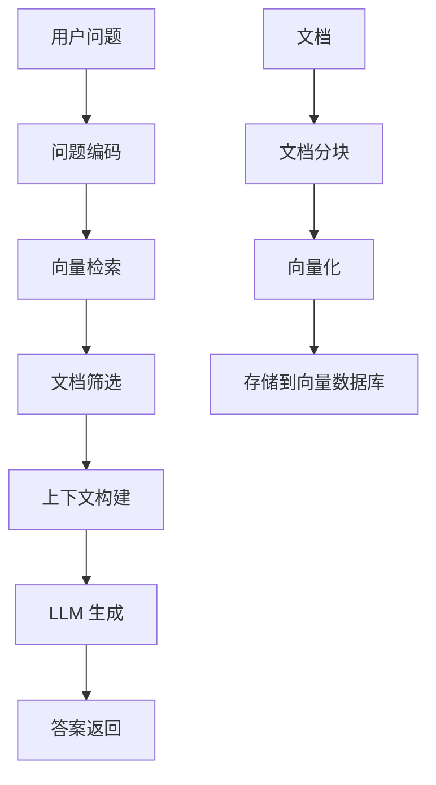

# RAG 实现

## 概述

RAG（Retrieval-Augmented Generation，检索增强生成）是一种结合了信息检索和文本生成的技术，它允许 LLM 在回答问题时从外部知识库中检索相关信息，从而提供更准确、更及时的答案。本文档将详细介绍如何在 LangGraph 中实现 RAG 系统。

## RAG 的核心概念

### 什么是 RAG？

RAG 系统包含两个主要组件：
1. **检索器（Retriever）**: 从知识库中找到相关文档
2. **生成器（Generator）**: 基于检索到的文档生成答案

### RAG 工作流程



### RAG 的优势

- **知识更新**: 无需重训练模型即可更新知识
- **准确性**: 基于真实文档回答，减少幻觉
- **可追溯**: 可以指出答案来源
- **成本效益**: 相比于训练大模型成本更低

## 基础 RAG 实现

### 文档处理和索引

```python
from langchain_community.document_loaders import TextLoader, PyPDFLoader
from langchain_text_splitters import RecursiveCharacterTextSplitter
from langchain_community.vectorstores import Chroma
from langchain_openai import OpenAIEmbeddings
from langchain_core.documents import Document
import os

class DocumentProcessor:
    """文档处理器"""

    def __init__(self, chunk_size=1000, chunk_overlap=200):
        self.chunk_size = chunk_size
        self.chunk_overlap = chunk_overlap
        self.text_splitter = RecursiveCharacterTextSplitter(
            chunk_size=chunk_size,
            chunk_overlap=chunk_overlap,
            length_function=len,
            separators=["\n\n", "\n", " ", ""]
        )

    def load_documents(self, file_paths):
        """加载多种格式的文档"""
        documents = []

        for file_path in file_paths:
            if not os.path.exists(file_path):
                print(f"文件不存在: {file_path}")
                continue

            try:
                if file_path.endswith('.txt'):
                    loader = TextLoader(file_path, encoding='utf-8')
                elif file_path.endswith('.pdf'):
                    loader = PyPDFLoader(file_path)
                else:
                    print(f"不支持的文件格式: {file_path}")
                    continue

                docs = loader.load()
                documents.extend(docs)
                print(f"成功加载: {file_path} ({len(docs)} 个文档)")

            except Exception as e:
                print(f"加载文件失败 {file_path}: {e}")

        return documents

    def split_documents(self, documents):
        """分割文档为较小的块"""
        splits = self.text_splitter.split_documents(documents)

        # 添加元数据
        for i, split in enumerate(splits):
            split.metadata.update({
                "chunk_id": i,
                "chunk_size": len(split.page_content),
                "source_type": "document"
            })

        print(f"文档分割完成: {len(splits)} 个文档块")
        return splits

    def create_sample_documents(self):
        """创建示例文档用于测试"""
        sample_docs = [
            Document(
                page_content="""
                LangGraph 是一个用于构建有状态、多参与者应用程序的库，它使用 LLM 构建。
                它扩展了 LangChain 表达式语言，具有定义涉及循环和条件的图的能力。
                LangGraph 的主要用例是添加循环和持久性到基于 LLM 的应用程序。
                """,
                metadata={"source": "langgraph_intro", "type": "introduction"}
            ),
            Document(
                page_content="""
                在 LangGraph 中，状态是通过 TypedDict 定义的。状态代表图中节点之间传递的信息。
                每个节点可以读取当前状态，修改状态，并将更新后的状态传递给下一个节点。
                状态管理是 LangGraph 的核心特性之一。
                """,
                metadata={"source": "langgraph_state", "type": "concept"}
            ),
            Document(
                page_content="""
                工具是 LangGraph 中与外部世界交互的方式。它们可以是函数、API 调用或任何其他操作。
                工具通过 @tool 装饰器定义，或者通过继承 BaseTool 类创建。
                Agent 可以根据用户输入决定是否调用工具以及调用哪个工具。
                """,
                metadata={"source": "langgraph_tools", "type": "concept"}
            )
        ]

        return sample_docs

# 向量存储设置
class VectorStoreManager:
    """向量存储管理器"""

    def __init__(self, embedding_model=None, persist_directory="./chroma_db"):
        self.embedding_model = embedding_model or OpenAIEmbeddings()
        self.persist_directory = persist_directory
        self.vectorstore = None

    def create_vectorstore(self, documents):
        """创建向量存储"""
        try:
            self.vectorstore = Chroma.from_documents(
                documents=documents,
                embedding=self.embedding_model,
                persist_directory=self.persist_directory
            )
            print(f"向量存储创建成功: {len(documents)} 个文档")
            return self.vectorstore

        except Exception as e:
            print(f"创建向量存储失败: {e}")
            return None

    def load_existing_vectorstore(self):
        """加载现有的向量存储"""
        try:
            self.vectorstore = Chroma(
                persist_directory=self.persist_directory,
                embedding_function=self.embedding_model
            )
            print("现有向量存储加载成功")
            return self.vectorstore

        except Exception as e:
            print(f"加载向量存储失败: {e}")
            return None

    def add_documents(self, documents):
        """添加文档到现有向量存储"""
        if not self.vectorstore:
            return self.create_vectorstore(documents)

        try:
            self.vectorstore.add_documents(documents)
            print(f"添加文档成功: {len(documents)} 个文档")

        except Exception as e:
            print(f"添加文档失败: {e}")

    def search(self, query, k=4, search_type="similarity"):
        """搜索相关文档"""
        if not self.vectorstore:
            print("向量存储未初始化")
            return []

        try:
            if search_type == "similarity":
                docs = self.vectorstore.similarity_search(query, k=k)
            elif search_type == "mmr":
                docs = self.vectorstore.max_marginal_relevance_search(query, k=k)
            else:
                docs = self.vectorstore.similarity_search(query, k=k)

            return docs

        except Exception as e:
            print(f"搜索失败: {e}")
            return []

# 基础 RAG 实现示例
def create_basic_rag_system():
    """创建基础 RAG 系统"""

    # 1. 文档处理
    processor = DocumentProcessor(chunk_size=500, chunk_overlap=50)

    # 使用示例文档
    documents = processor.create_sample_documents()
    splits = processor.split_documents(documents)

    # 2. 创建向量存储
    vector_manager = VectorStoreManager()
    vectorstore = vector_manager.create_vectorstore(splits)

    # 3. 创建检索器
    retriever = vectorstore.as_retriever(
        search_type="similarity",
        search_kwargs={"k": 3}
    )

    return retriever, vectorstore

# 测试基础 RAG
def test_basic_rag():
    """测试基础 RAG 功能"""
    retriever, vectorstore = create_basic_rag_system()

    # 测试查询
    query = "什么是 LangGraph 的状态管理？"
    relevant_docs = retriever.invoke(query)

    print(f"查询: {query}")
    print(f"找到 {len(relevant_docs)} 个相关文档:")
    print("-" * 50)

    for i, doc in enumerate(relevant_docs):
        print(f"文档 {i+1}:")
        print(f"内容: {doc.page_content[:200]}...")
        print(f"来源: {doc.metadata.get('source', 'unknown')}")
        print("-" * 30)

# test_basic_rag()
```

### 创建 RAG 工具

```python
from langchain_core.tools import tool
from langchain_core.documents import Document
from typing import List

class RAGTool:
    """RAG 检索工具"""

    def __init__(self, retriever, llm=None):
        self.retriever = retriever
        self.llm = llm

    @tool
    def search_knowledge_base(self, query: str, k: int = 3) -> List[dict]:
        """在知识库中搜索相关信息

        Args:
            query: 搜索查询
            k: 返回的文档数量

        Returns:
            相关文档列表
        """
        try:
            docs = self.retriever.invoke(query)
            results = []

            for doc in docs[:k]:
                results.append({
                    "content": doc.page_content,
                    "metadata": doc.metadata,
                    "relevance_score": getattr(doc, 'relevance_score', None)
                })

            return results

        except Exception as e:
            return [{"error": f"搜索失败: {str(e)}"}]

    def create_context_from_docs(self, docs: List[Document]) -> str:
        """从文档列表创建上下文"""
        context_parts = []

        for i, doc in enumerate(docs):
            source = doc.metadata.get('source', f'文档{i+1}')
            content = doc.page_content.strip()
            context_parts.append(f"[来源: {source}]\n{content}")

        return "\n\n".join(context_parts)

    def answer_with_context(self, question: str, context: str) -> str:
        """基于上下文回答问题"""
        if not self.llm:
            return "LLM 未配置"

        prompt = f"""基于以下上下文信息回答问题。如果上下文中没有相关信息，请说明。

上下文信息:
{context}

问题: {question}

回答:"""

        try:
            response = self.llm.invoke([{"role": "user", "content": prompt}])
            return response.content

        except Exception as e:
            return f"生成回答失败: {str(e)}"

# 创建完整的 RAG 工具
def create_rag_tool():
    """创建完整的 RAG 工具"""
    from langchain_openai import ChatOpenAI

    # 创建 RAG 系统组件
    retriever, vectorstore = create_basic_rag_system()
    llm = ChatOpenAI(model="gpt-3.5-turbo", temperature=0.1)

    # 创建 RAG 工具
    rag_tool = RAGTool(retriever, llm)

    @tool
    def intelligent_search(query: str) -> str:
        """智能搜索并回答问题

        Args:
            query: 用户问题

        Returns:
            基于知识库的答案
        """
        # 1. 检索相关文档
        search_results = rag_tool.search_knowledge_base.invoke({"query": query, "k": 3})

        if not search_results or "error" in search_results[0]:
            return "抱歉，未能在知识库中找到相关信息。"

        # 2. 构建上下文
        docs = [
            Document(page_content=result["content"], metadata=result["metadata"])
            for result in search_results if "content" in result
        ]
        context = rag_tool.create_context_from_docs(docs)

        # 3. 生成答案
        answer = rag_tool.answer_with_context(query, context)

        # 4. 添加来源信息
        sources = [doc.metadata.get('source', '未知') for doc in docs]
        unique_sources = list(set(sources))

        final_answer = f"{answer}\n\n参考来源: {', '.join(unique_sources)}"
        return final_answer

    return intelligent_search
```

## 高级 RAG 技术

### 混合检索（Hybrid Retrieval）

```python
from langchain_community.retrievers import BM25Retriever
from langchain.retrievers import EnsembleRetriever

class HybridRetriever:
    """混合检索器：结合密集检索和稀疏检索"""

    def __init__(self, documents, vectorstore):
        self.documents = documents
        self.vectorstore = vectorstore
        self.hybrid_retriever = None
        self._setup_hybrid_retriever()

    def _setup_hybrid_retriever(self):
        """设置混合检索器"""
        try:
            # 1. 密集检索器（向量相似度）
            dense_retriever = self.vectorstore.as_retriever(
                search_kwargs={"k": 5}
            )

            # 2. 稀疏检索器（关键词匹配）
            sparse_retriever = BM25Retriever.from_documents(
                self.documents
            )
            sparse_retriever.k = 5

            # 3. 组合检索器
            self.hybrid_retriever = EnsembleRetriever(
                retrievers=[dense_retriever, sparse_retriever],
                weights=[0.6, 0.4]  # 密集检索权重更高
            )

            print("混合检索器设置成功")

        except Exception as e:
            print(f"混合检索器设置失败: {e}")

    def search(self, query, k=4):
        """混合搜索"""
        if not self.hybrid_retriever:
            return []

        try:
            results = self.hybrid_retriever.invoke(query)
            return results[:k]

        except Exception as e:
            print(f"混合搜索失败: {e}")
            return []

# 查询重写和扩展
class QueryProcessor:
    """查询处理器"""

    def __init__(self, llm):
        self.llm = llm

    def rewrite_query(self, original_query: str) -> List[str]:
        """重写查询为多个变体"""
        prompt = f"""
        请将以下查询重写为3个不同但相关的查询变体，以提高检索效果：

        原始查询: {original_query}

        请提供3个重写的查询，每行一个：
        """

        try:
            response = self.llm.invoke([{"role": "user", "content": prompt}])
            queries = [q.strip() for q in response.content.split('\n') if q.strip()]
            return queries[:3] if len(queries) >= 3 else [original_query]

        except Exception as e:
            print(f"查询重写失败: {e}")
            return [original_query]

    def expand_query(self, query: str) -> str:
        """扩展查询添加相关术语"""
        prompt = f"""
        请为以下查询添加相关的同义词和术语，以提高检索召回率：

        原始查询: {query}

        扩展查询:
        """

        try:
            response = self.llm.invoke([{"role": "user", "content": prompt}])
            return response.content.strip()

        except Exception as e:
            print(f"查询扩展失败: {e}")
            return query

# 重排序和过滤
class ResultProcessor:
    """结果处理器"""

    def __init__(self, llm):
        self.llm = llm

    def rerank_documents(self, query: str, documents: List[Document], top_k: int = 3) -> List[Document]:
        """重新排序文档"""
        if len(documents) <= top_k:
            return documents

        # 简单的相关性评分
        scored_docs = []
        for doc in documents:
            score = self._calculate_relevance_score(query, doc.page_content)
            scored_docs.append((score, doc))

        # 按分数排序
        scored_docs.sort(key=lambda x: x[0], reverse=True)
        return [doc for _, doc in scored_docs[:top_k]]

    def _calculate_relevance_score(self, query: str, content: str) -> float:
        """计算相关性分数"""
        query_words = set(query.lower().split())
        content_words = set(content.lower().split())

        # 简单的 Jaccard 相似度
        intersection = query_words.intersection(content_words)
        union = query_words.union(content_words)

        return len(intersection) / len(union) if union else 0

    def filter_documents(self, documents: List[Document], min_length: int = 50) -> List[Document]:
        """过滤文档"""
        filtered = []

        for doc in documents:
            # 过滤太短的文档
            if len(doc.page_content) < min_length:
                continue

            # 可以添加更多过滤条件
            # 如检查语言、质量等

            filtered.append(doc)

        return filtered

# 高级 RAG 系统
class AdvancedRAGSystem:
    """高级 RAG 系统"""

    def __init__(self, documents, vectorstore, llm):
        self.documents = documents
        self.vectorstore = vectorstore
        self.llm = llm

        # 初始化组件
        self.hybrid_retriever = HybridRetriever(documents, vectorstore)
        self.query_processor = QueryProcessor(llm)
        self.result_processor = ResultProcessor(llm)

    def advanced_retrieve(self, query: str, strategy: str = "hybrid") -> List[Document]:
        """高级检索"""
        if strategy == "hybrid":
            return self._hybrid_retrieve(query)
        elif strategy == "multi_query":
            return self._multi_query_retrieve(query)
        elif strategy == "expanded":
            return self._expanded_query_retrieve(query)
        else:
            return self.vectorstore.similarity_search(query, k=4)

    def _hybrid_retrieve(self, query: str) -> List[Document]:
        """混合检索策略"""
        docs = self.hybrid_retriever.search(query, k=6)
        filtered_docs = self.result_processor.filter_documents(docs)
        reranked_docs = self.result_processor.rerank_documents(query, filtered_docs, top_k=4)
        return reranked_docs

    def _multi_query_retrieve(self, query: str) -> List[Document]:
        """多查询检索策略"""
        # 生成查询变体
        query_variants = self.query_processor.rewrite_query(query)

        all_docs = []
        for variant in query_variants:
            docs = self.vectorstore.similarity_search(variant, k=3)
            all_docs.extend(docs)

        # 去重并重排序
        unique_docs = self._deduplicate_documents(all_docs)
        reranked_docs = self.result_processor.rerank_documents(query, unique_docs, top_k=4)
        return reranked_docs

    def _expanded_query_retrieve(self, query: str) -> List[Document]:
        """扩展查询检索策略"""
        expanded_query = self.query_processor.expand_query(query)
        docs = self.vectorstore.similarity_search(expanded_query, k=5)
        filtered_docs = self.result_processor.filter_documents(docs)
        return filtered_docs[:4]

    def _deduplicate_documents(self, documents: List[Document]) -> List[Document]:
        """去重文档"""
        seen_content = set()
        unique_docs = []

        for doc in documents:
            content_hash = hash(doc.page_content)
            if content_hash not in seen_content:
                seen_content.add(content_hash)
                unique_docs.append(doc)

        return unique_docs

    def generate_answer(self, query: str, strategy: str = "hybrid") -> dict:
        """生成增强答案"""
        # 1. 检索相关文档
        relevant_docs = self.advanced_retrieve(query, strategy)

        if not relevant_docs:
            return {
                "answer": "抱歉，未能找到相关信息。",
                "sources": [],
                "strategy": strategy
            }

        # 2. 构建上下文
        context = self._build_context(relevant_docs)

        # 3. 生成答案
        answer = self._generate_contextualized_answer(query, context)

        # 4. 提取来源
        sources = self._extract_sources(relevant_docs)

        return {
            "answer": answer,
            "sources": sources,
            "context": context,
            "strategy": strategy,
            "num_docs": len(relevant_docs)
        }

    def _build_context(self, documents: List[Document]) -> str:
        """构建上下文"""
        context_parts = []

        for i, doc in enumerate(documents):
            source = doc.metadata.get('source', f'文档{i+1}')
            content = doc.page_content.strip()
            context_parts.append(f"[{i+1}] 来源: {source}\n{content}")

        return "\n\n".join(context_parts)

    def _generate_contextualized_answer(self, query: str, context: str) -> str:
        """生成基于上下文的答案"""
        prompt = f"""
        基于以下上下文信息，详细回答用户的问题。要求：
        1. 答案要准确，基于提供的上下文
        2. 如果上下文中没有相关信息，明确说明
        3. 引用具体的来源编号（如 [1], [2]）
        4. 保持答案的逻辑性和连贯性

        上下文信息:
        {context}

        用户问题: {query}

        详细回答:
        """

        try:
            response = self.llm.invoke([{"role": "user", "content": prompt}])
            return response.content

        except Exception as e:
            return f"生成答案时出错: {str(e)}"

    def _extract_sources(self, documents: List[Document]) -> List[dict]:
        """提取来源信息"""
        sources = []

        for doc in documents:
            source_info = {
                "source": doc.metadata.get('source', '未知来源'),
                "type": doc.metadata.get('type', '文档'),
                "chunk_id": doc.metadata.get('chunk_id', 0),
                "content_preview": doc.page_content[:100] + "..."
            }
            sources.append(source_info)

        return sources

# 创建高级 RAG 工具
def create_advanced_rag_tool():
    """创建高级 RAG 工具"""
    from langchain_openai import ChatOpenAI

    # 创建组件
    processor = DocumentProcessor()
    documents = processor.create_sample_documents()
    splits = processor.split_documents(documents)

    vector_manager = VectorStoreManager()
    vectorstore = vector_manager.create_vectorstore(splits)

    llm = ChatOpenAI(model="gpt-4", temperature=0.1)

    # 创建高级 RAG 系统
    rag_system = AdvancedRAGSystem(splits, vectorstore, llm)

    @tool
    def advanced_search(query: str, strategy: str = "hybrid") -> dict:
        """高级智能搜索

        Args:
            query: 搜索查询
            strategy: 检索策略 ('hybrid', 'multi_query', 'expanded', 'simple')

        Returns:
            包含答案、来源和元信息的字典
        """
        return rag_system.generate_answer(query, strategy)

    return advanced_search

# 测试高级 RAG
def test_advanced_rag():
    """测试高级 RAG 功能"""
    advanced_search = create_advanced_rag_tool()

    test_queries = [
        "LangGraph 的主要特性是什么？",
        "如何在 LangGraph 中管理状态？",
        "工具在 LangGraph 中的作用"
    ]

    strategies = ["hybrid", "multi_query", "expanded", "simple"]

    for query in test_queries:
        print(f"\n{'='*60}")
        print(f"查询: {query}")
        print('='*60)

        for strategy in strategies:
            print(f"\n策略: {strategy}")
            print("-" * 40)

            result = advanced_search.invoke({
                "query": query,
                "strategy": strategy
            })

            print(f"答案: {result['answer'][:200]}...")
            print(f"来源数量: {len(result['sources'])}")
            print(f"文档数量: {result['num_docs']}")

# test_advanced_rag()
```

## Agentic RAG 实现

### 什么是 Agentic RAG？

Agentic RAG 是一种更智能的 RAG 变体，其中 Agent 可以：
- 决定是否需要检索信息
- 选择合适的检索策略
- 迭代改进查询
- 综合多次检索结果

### 实现 Agentic RAG

```python
from langgraph.graph import StateGraph, END
from typing import TypedDict, List
from langchain_core.messages import HumanMessage, AIMessage

class AgenticRAGState(TypedDict):
    """Agentic RAG 状态"""
    original_query: str
    current_query: str
    messages: List
    retrieved_docs: List[Document]
    search_attempts: int
    max_attempts: int
    confidence_score: float
    final_answer: str
    need_more_info: bool

class AgenticRAGSystem:
    """智能 RAG 系统"""

    def __init__(self, rag_system, llm):
        self.rag_system = rag_system
        self.llm = llm
        self.graph = self._build_graph()

    def _build_graph(self):
        """构建 Agentic RAG 图"""
        graph = StateGraph(AgenticRAGState)

        # 添加节点
        graph.add_node("analyze_query", self.analyze_query)
        graph.add_node("retrieve_info", self.retrieve_info)
        graph.add_node("evaluate_results", self.evaluate_results)
        graph.add_node("refine_query", self.refine_query)
        graph.add_node("generate_answer", self.generate_answer)

        # 设置路由
        graph.set_entry_point("analyze_query")

        graph.add_edge("analyze_query", "retrieve_info")
        graph.add_edge("retrieve_info", "evaluate_results")

        graph.add_conditional_edges(
            "evaluate_results",
            self.decide_next_step,
            {
                "refine": "refine_query",
                "answer": "generate_answer",
                "end": END
            }
        )

        graph.add_edge("refine_query", "retrieve_info")
        graph.add_edge("generate_answer", END)

        return graph.compile()

    def analyze_query(self, state: AgenticRAGState) -> AgenticRAGState:
        """分析查询"""
        query = state["original_query"]

        # 分析查询复杂度和类型
        analysis_prompt = f"""
        分析以下查询并回答：
        1. 这个查询需要检索外部信息吗？(是/否)
        2. 查询的复杂度是什么？(简单/中等/复杂)
        3. 建议的检索策略是什么？(simple/hybrid/multi_query/expanded)

        查询: {query}

        请按以下格式回答：
        需要检索: [是/否]
        复杂度: [简单/中等/复杂]
        策略: [strategy]
        """

        try:
            response = self.llm.invoke([HumanMessage(content=analysis_prompt)])
            analysis = response.content

            # 解析分析结果（简化版）
            need_retrieval = "是" in analysis
            if "复杂" in analysis:
                strategy = "multi_query"
            elif "中等" in analysis:
                strategy = "hybrid"
            else:
                strategy = "simple"

            return {
                **state,
                "current_query": query,
                "search_attempts": 0,
                "max_attempts": 3,
                "need_more_info": need_retrieval,
                "messages": [HumanMessage(content=f"查询分析: {analysis}")]
            }

        except Exception as e:
            return {
                **state,
                "current_query": query,
                "search_attempts": 0,
                "max_attempts": 3,
                "need_more_info": True,
                "messages": [HumanMessage(content=f"分析失败: {e}")]
            }

    def retrieve_info(self, state: AgenticRAGState) -> AgenticRAGState:
        """检索信息"""
        if not state["need_more_info"]:
            return state

        query = state["current_query"]
        attempts = state["search_attempts"]

        # 根据尝试次数选择策略
        strategies = ["simple", "hybrid", "multi_query", "expanded"]
        strategy = strategies[min(attempts, len(strategies) - 1)]

        try:
            result = self.rag_system.generate_answer(query, strategy)
            docs = result.get("sources", [])

            new_messages = state["messages"] + [
                HumanMessage(content=f"检索尝试 {attempts + 1}: 使用 {strategy} 策略"),
                AIMessage(content=f"找到 {len(docs)} 个相关文档")
            ]

            return {
                **state,
                "retrieved_docs": docs,
                "search_attempts": attempts + 1,
                "messages": new_messages
            }

        except Exception as e:
            error_message = f"检索失败: {e}"
            new_messages = state["messages"] + [AIMessage(content=error_message)]

            return {
                **state,
                "retrieved_docs": [],
                "search_attempts": attempts + 1,
                "messages": new_messages
            }

    def evaluate_results(self, state: AgenticRAGState) -> AgenticRAGState:
        """评估检索结果"""
        docs = state["retrieved_docs"]
        query = state["original_query"]

        if not docs:
            confidence = 0.0
        else:
            # 简单的置信度计算
            confidence = min(len(docs) / 3.0, 1.0)  # 基于文档数量

        # 评估内容相关性
        if docs:
            relevance_prompt = f"""
            评估以下文档对于查询的相关性，给出 0-10 的分数：

            查询: {query}

            文档摘要: {docs[0].get('content_preview', '') if docs else '无文档'}

            相关性分数 (0-10):
            """

            try:
                response = self.llm.invoke([HumanMessage(content=relevance_prompt)])
                relevance_text = response.content.strip()
                relevance_score = float([s for s in relevance_text.split() if s.isdigit()][-1]) / 10.0
                confidence = (confidence + relevance_score) / 2.0

            except:
                pass

        return {
            **state,
            "confidence_score": confidence
        }

    def decide_next_step(self, state: AgenticRAGState) -> str:
        """决定下一步行动"""
        confidence = state["confidence_score"]
        attempts = state["search_attempts"]
        max_attempts = state["max_attempts"]

        # 决策逻辑
        if confidence >= 0.7:
            return "answer"  # 置信度足够，生成答案
        elif attempts >= max_attempts:
            return "end"  # 达到最大尝试次数
        else:
            return "refine"  # 改进查询并重试

    def refine_query(self, state: AgenticRAGState) -> AgenticRAGState:
        """改进查询"""
        original_query = state["original_query"]
        current_query = state["current_query"]
        attempts = state["search_attempts"]

        refine_prompt = f"""
        之前的检索没有找到足够相关的信息。请重新表述查询以提高检索效果：

        原始查询: {original_query}
        当前查询: {current_query}
        尝试次数: {attempts}

        改进的查询:
        """

        try:
            response = self.llm.invoke([HumanMessage(content=refine_prompt)])
            refined_query = response.content.strip()

            new_messages = state["messages"] + [
                HumanMessage(content=f"查询改进: {refined_query}")
            ]

            return {
                **state,
                "current_query": refined_query,
                "messages": new_messages
            }

        except Exception as e:
            return {
                **state,
                "current_query": original_query,  # 回退到原始查询
                "messages": state["messages"] + [AIMessage(content=f"查询改进失败: {e}")]
            }

    def generate_answer(self, state: AgenticRAGState) -> AgenticRAGState:
        """生成最终答案"""
        query = state["original_query"]
        docs = state["retrieved_docs"]
        confidence = state["confidence_score"]

        if not docs:
            final_answer = "抱歉，我无法在知识库中找到相关信息来回答您的问题。"
        else:
            # 构建上下文
            context = "\n\n".join([
                f"文档 {i+1}: {doc.get('content_preview', '')}"
                for i, doc in enumerate(docs[:3])
            ])

            answer_prompt = f"""
            基于以下信息回答用户问题：

            上下文: {context}
            问题: {query}
            置信度: {confidence:.2f}

            请提供详细、准确的答案。如果置信度较低，请在答案中说明不确定性。

            答案:
            """

            try:
                response = self.llm.invoke([HumanMessage(content=answer_prompt)])
                final_answer = response.content

            except Exception as e:
                final_answer = f"生成答案时出错: {e}"

        new_messages = state["messages"] + [
            AIMessage(content=f"最终答案: {final_answer}")
        ]

        return {
            **state,
            "final_answer": final_answer,
            "messages": new_messages
        }

    def run(self, query: str) -> dict:
        """运行 Agentic RAG"""
        initial_state = {
            "original_query": query,
            "current_query": query,
            "messages": [],
            "retrieved_docs": [],
            "search_attempts": 0,
            "max_attempts": 3,
            "confidence_score": 0.0,
            "final_answer": "",
            "need_more_info": True
        }

        result = self.graph.invoke(initial_state)
        return {
            "query": query,
            "answer": result["final_answer"],
            "confidence": result["confidence_score"],
            "attempts": result["search_attempts"],
            "process": [msg.content for msg in result["messages"]]
        }

# 创建 Agentic RAG 工具
def create_agentic_rag_tool():
    """创建 Agentic RAG 工具"""
    from langchain_openai import ChatOpenAI

    # 创建基础组件
    processor = DocumentProcessor()
    documents = processor.create_sample_documents()
    splits = processor.split_documents(documents)

    vector_manager = VectorStoreManager()
    vectorstore = vector_manager.create_vectorstore(splits)

    llm = ChatOpenAI(model="gpt-4", temperature=0.1)
    base_rag = AdvancedRAGSystem(splits, vectorstore, llm)

    # 创建 Agentic RAG
    agentic_rag = AgenticRAGSystem(base_rag, llm)

    @tool
    def intelligent_rag_search(query: str) -> dict:
        """智能 RAG 搜索，具有自适应检索和答案生成

        Args:
            query: 用户查询

        Returns:
            包含答案、置信度和处理过程的结果
        """
        return agentic_rag.run(query)

    return intelligent_rag_search

# 测试 Agentic RAG
def test_agentic_rag():
    """测试 Agentic RAG 系统"""
    agentic_search = create_agentic_rag_tool()

    test_queries = [
        "LangGraph 是什么？",
        "如何在 LangGraph 中实现复杂的条件逻辑？",  # 可能需要多次检索
        "Python 的历史发展"  # 知识库中没有的信息
    ]

    for query in test_queries:
        print(f"\n{'='*60}")
        print(f"测试查询: {query}")
        print('='*60)

        result = agentic_search.invoke({"query": query})

        print(f"答案: {result['answer']}")
        print(f"置信度: {result['confidence']:.2f}")
        print(f"检索尝试次数: {result['attempts']}")
        print(f"处理过程:")
        for i, step in enumerate(result['process']):
            print(f"  {i+1}. {step}")

# test_agentic_rag()
```

## 最佳实践

### 1. 文档预处理优化

```python
def advanced_document_processing():
    """高级文档处理"""

    # 智能分块策略
    class SmartTextSplitter:
        def __init__(self):
            self.splitters = {
                'code': RecursiveCharacterTextSplitter(
                    chunk_size=800,
                    chunk_overlap=100,
                    separators=["\n\nclass ", "\n\ndef ", "\n\n```", "\n\n"]
                ),
                'text': RecursiveCharacterTextSplitter(
                    chunk_size=1000,
                    chunk_overlap=200,
                    separators=["\n\n", "\n", ". ", " "]
                ),
                'academic': RecursiveCharacterTextSplitter(
                    chunk_size=1200,
                    chunk_overlap=300,
                    separators=["\n\n# ", "\n\n## ", "\n\n", "\n"]
                )
            }

        def split_by_type(self, document: Document) -> List[Document]:
            # 根据文档类型选择分割策略
            doc_type = self._detect_document_type(document)
            splitter = self.splitters.get(doc_type, self.splitters['text'])
            return splitter.split_documents([document])

        def _detect_document_type(self, document: Document) -> str:
            content = document.page_content
            if '```' in content or 'def ' in content or 'class ' in content:
                return 'code'
            elif '# ' in content and '## ' in content:
                return 'academic'
            else:
                return 'text'

    return SmartTextSplitter()

# 元数据增强
def enhance_document_metadata(documents: List[Document]) -> List[Document]:
    """增强文档元数据"""
    enhanced_docs = []

    for doc in documents:
        # 计算文档特征
        content = doc.page_content
        enhanced_metadata = {
            **doc.metadata,
            'length': len(content),
            'word_count': len(content.split()),
            'has_code': bool('def ' in content or 'class ' in content),
            'has_numbers': bool(any(c.isdigit() for c in content)),
            'language': 'zh' if any('\u4e00' <= c <= '\u9fff' for c in content) else 'en'
        }

        enhanced_doc = Document(
            page_content=content,
            metadata=enhanced_metadata
        )
        enhanced_docs.append(enhanced_doc)

    return enhanced_docs
```

### 2. 检索优化

```python
# 自适应检索参数
class AdaptiveRetriever:
    """自适应检索器"""

    def __init__(self, vectorstore):
        self.vectorstore = vectorstore
        self.query_history = []

    def adaptive_search(self, query: str) -> List[Document]:
        """根据查询特征自适应调整检索参数"""
        query_features = self._analyze_query(query)

        # 根据查询特征调整参数
        k = self._determine_k(query_features)
        search_type = self._determine_search_type(query_features)

        if search_type == "similarity":
            docs = self.vectorstore.similarity_search(query, k=k)
        elif search_type == "mmr":
            docs = self.vectorstore.max_marginal_relevance_search(query, k=k, fetch_k=k*2)
        else:
            docs = self.vectorstore.similarity_search(query, k=k)

        # 记录查询历史
        self.query_history.append({
            'query': query,
            'features': query_features,
            'results_count': len(docs)
        })

        return docs

    def _analyze_query(self, query: str) -> dict:
        """分析查询特征"""
        return {
            'length': len(query),
            'word_count': len(query.split()),
            'has_question_words': any(word in query.lower() for word in ['什么', '如何', '为什么', '哪里', 'what', 'how', 'why', 'where']),
            'is_specific': len(query.split()) > 5,
            'is_comparative': any(word in query.lower() for word in ['比较', 'vs', '区别', 'compare', 'difference'])
        }

    def _determine_k(self, features: dict) -> int:
        """确定检索数量"""
        if features['is_comparative']:
            return 6  # 比较性查询需要更多文档
        elif features['is_specific']:
            return 3  # 具体查询需要精确文档
        else:
            return 4  # 默认数量

    def _determine_search_type(self, features: dict) -> str:
        """确定搜索类型"""
        if features['is_comparative']:
            return "mmr"  # 比较性查询使用最大边际相关性
        else:
            return "similarity"  # 其他使用相似性搜索
```

### 3. 上下文优化

```python
# 上下文压缩和优化
class ContextOptimizer:
    """上下文优化器"""

    def __init__(self, llm, max_context_length=4000):
        self.llm = llm
        self.max_context_length = max_context_length

    def optimize_context(self, query: str, documents: List[Document]) -> str:
        """优化上下文"""
        # 1. 相关性排序
        ranked_docs = self._rank_by_relevance(query, documents)

        # 2. 提取关键信息
        key_info = self._extract_key_information(query, ranked_docs)

        # 3. 压缩上下文
        compressed_context = self._compress_context(key_info)

        return compressed_context

    def _rank_by_relevance(self, query: str, documents: List[Document]) -> List[Document]:
        """按相关性排序"""
        # 简化的相关性计算
        scored_docs = []
        query_words = set(query.lower().split())

        for doc in documents:
            doc_words = set(doc.page_content.lower().split())
            overlap = len(query_words.intersection(doc_words))
            score = overlap / len(query_words) if query_words else 0
            scored_docs.append((score, doc))

        scored_docs.sort(key=lambda x: x[0], reverse=True)
        return [doc for _, doc in scored_docs]

    def _extract_key_information(self, query: str, documents: List[Document]) -> List[str]:
        """提取关键信息"""
        key_info = []

        for doc in documents[:3]:  # 只处理前3个最相关的文档
            extract_prompt = f"""
            从以下文档中提取与查询最相关的关键信息：

            查询: {query}

            文档: {doc.page_content}

            关键信息 (50字以内):
            """

            try:
                response = self.llm.invoke([{"role": "user", "content": extract_prompt}])
                key_info.append(response.content.strip())
            except:
                # 如果提取失败，使用原文本的前200字符
                key_info.append(doc.page_content[:200])

        return key_info

    def _compress_context(self, key_info: List[str]) -> str:
        """压缩上下文"""
        combined_info = "\n\n".join(key_info)

        if len(combined_info) <= self.max_context_length:
            return combined_info

        # 如果太长，进一步压缩
        compress_prompt = f"""
        将以下信息压缩为不超过 {self.max_context_length} 字符，保留所有关键点：

        {combined_info}

        压缩后的信息:
        """

        try:
            response = self.llm.invoke([{"role": "user", "content": compress_prompt}])
            return response.content.strip()
        except:
            # 如果压缩失败，简单截断
            return combined_info[:self.max_context_length]
```

## 总结

RAG 是增强 LLM 能力的重要技术，关键要点：

1. **系统化实现**: 文档处理、向量化、检索、生成的完整流程
2. **高级技术**: 混合检索、查询优化、结果重排序
3. **智能化**: Agentic RAG 实现自适应检索和生成
4. **优化策略**: 上下文压缩、元数据增强、自适应参数
5. **最佳实践**: 选择合适的分块策略、检索方法和优化技术

下一章节将介绍如何集成外部 API 来进一步扩展系统能力。