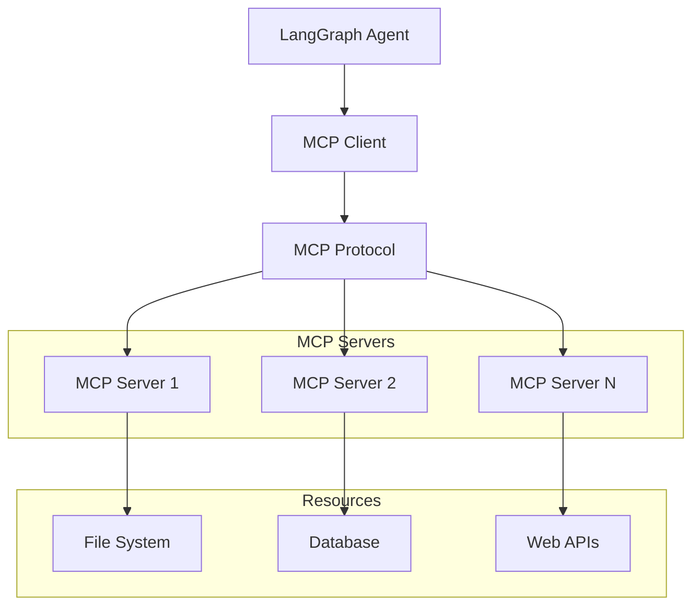

# MCP 协议

## 概述

MCP（Model Context Protocol）是一个开放标准，旨在让 AI 应用程序能够与外部数据源和工具进行无缝集成。MCP 提供了一种标准化的方式来连接 LLM 与各种上下文源，如文件系统、数据库、API 等。本文档将详细介绍如何在 LangGraph 中集成和使用 MCP 协议。

## MCP 的核心概念

### 什么是 MCP？

MCP 是一个通信协议，它定义了：
1. **标准化接口**: 统一的工具和资源访问方式
2. **双向通信**: 客户端和服务器之间的交互协议
3. **类型安全**: 强类型的消息格式和验证
4. **扩展性**: 支持自定义工具和资源类型

### MCP 架构



### MCP 的优势

- **标准化**: 统一的接口减少集成复杂性
- **安全性**: 内置的权限控制和访问管理
- **可组合性**: 可以同时使用多个 MCP 服务器
- **类型安全**: 强类型系统确保数据一致性

## MCP 基础集成

### 安装和设置

```python
# 安装必要的包
# pip install langchain-mcp-adapters

from langchain_mcp_adapters import MCPClientToolkit
from typing import List, Dict, Any
import json

class MCPClientManager:
    """MCP 客户端管理器"""

    def __init__(self):
        self.servers = {}
        self.toolkits = {}

    def add_server(self, name: str, command: List[str], env: Dict[str, str] = None):
        """添加 MCP 服务器"""
        try:
            # 创建 MCP 工具包
            toolkit = MCPClientToolkit(
                server_command=command,
                server_env=env or {}
            )

            self.servers[name] = {
                "command": command,
                "env": env,
                "status": "connected"
            }
            self.toolkits[name] = toolkit

            print(f"MCP 服务器 '{name}' 连接成功")
            return True

        except Exception as e:
            print(f"连接 MCP 服务器 '{name}' 失败: {e}")
            return False

    def get_toolkit(self, server_name: str):
        """获取指定服务器的工具包"""
        return self.toolkits.get(server_name)

    def get_all_tools(self) -> List:
        """获取所有可用工具"""
        all_tools = []
        for toolkit in self.toolkits.values():
            try:
                tools = toolkit.get_tools()
                all_tools.extend(tools)
            except Exception as e:
                print(f"获取工具失败: {e}")
        return all_tools

    def list_servers(self) -> Dict[str, Any]:
        """列出所有服务器状态"""
        return self.servers

    def disconnect_server(self, name: str):
        """断开服务器连接"""
        if name in self.toolkits:
            try:
                # MCP 客户端通常会自动处理断开连接
                del self.toolkits[name]
                del self.servers[name]
                print(f"MCP 服务器 '{name}' 已断开")
                return True
            except Exception as e:
                print(f"断开服务器 '{name}' 失败: {e}")
                return False
        return False

# 基础使用示例
def create_basic_mcp_setup():
    """创建基础 MCP 设置"""

    # 创建 MCP 客户端管理器
    mcp_manager = MCPClientManager()

    # 添加文件系统 MCP 服务器
    # 注意：这需要实际的 MCP 服务器实现
    filesystem_command = ["mcp-server-filesystem", "/path/to/directory"]
    mcp_manager.add_server("filesystem", filesystem_command)

    # 添加数据库 MCP 服务器
    database_command = ["mcp-server-database", "--connection-string", "sqlite:///example.db"]
    mcp_manager.add_server("database", database_command)

    return mcp_manager

# 模拟 MCP 服务器（用于测试）
class MockMCPServer:
    """模拟 MCP 服务器"""

    def __init__(self, server_type: str):
        self.server_type = server_type
        self.resources = []
        self.tools = []
        self._initialize_mock_data()

    def _initialize_mock_data(self):
        """初始化模拟数据"""
        if self.server_type == "filesystem":
            self.resources = [
                {"uri": "file:///documents/readme.txt", "name": "README", "type": "text"},
                {"uri": "file:///documents/config.json", "name": "Config", "type": "json"},
                {"uri": "file:///documents/data.csv", "name": "Data", "type": "csv"}
            ]
            self.tools = ["read_file", "write_file", "list_directory"]

        elif self.server_type == "database":
            self.resources = [
                {"uri": "db://users", "name": "Users Table", "type": "table"},
                {"uri": "db://products", "name": "Products Table", "type": "table"},
                {"uri": "db://orders", "name": "Orders Table", "type": "table"}
            ]
            self.tools = ["query_database", "execute_sql", "get_schema"]

        elif self.server_type == "web":
            self.resources = [
                {"uri": "https://api.example.com/users", "name": "Users API", "type": "api"},
                {"uri": "https://api.example.com/posts", "name": "Posts API", "type": "api"}
            ]
            self.tools = ["fetch_url", "post_data", "get_api_info"]

    def list_resources(self):
        """列出资源"""
        return self.resources

    def list_tools(self):
        """列出工具"""
        return self.tools

    def read_resource(self, uri: str):
        """读取资源"""
        # 模拟资源内容
        mock_content = {
            "file:///documents/readme.txt": "这是一个 README 文件的内容...",
            "file:///documents/config.json": '{"app_name": "MyApp", "version": "1.0"}',
            "file:///documents/data.csv": "name,age,city\nAlice,25,Beijing\nBob,30,Shanghai",
            "db://users": "用户表包含 ID、姓名、邮箱等字段",
            "db://products": "产品表包含 ID、名称、价格等字段",
            "https://api.example.com/users": '{"users": [{"id": 1, "name": "User1"}]}'
        }

        return mock_content.get(uri, f"未找到资源: {uri}")

    def call_tool(self, tool_name: str, arguments: Dict[str, Any]):
        """调用工具"""
        if self.server_type == "filesystem":
            return self._call_filesystem_tool(tool_name, arguments)
        elif self.server_type == "database":
            return self._call_database_tool(tool_name, arguments)
        elif self.server_type == "web":
            return self._call_web_tool(tool_name, arguments)
        else:
            return {"error": f"未知的工具: {tool_name}"}

    def _call_filesystem_tool(self, tool_name: str, arguments: Dict[str, Any]):
        """调用文件系统工具"""
        if tool_name == "read_file":
            path = arguments.get("path", "")
            return {"content": f"文件 {path} 的内容..."}
        elif tool_name == "write_file":
            path = arguments.get("path", "")
            content = arguments.get("content", "")
            return {"result": f"成功写入文件 {path}"}
        elif tool_name == "list_directory":
            path = arguments.get("path", "/")
            return {"files": ["file1.txt", "file2.json", "subdir/"]}
        else:
            return {"error": f"未知的文件系统工具: {tool_name}"}

    def _call_database_tool(self, tool_name: str, arguments: Dict[str, Any]):
        """调用数据库工具"""
        if tool_name == "query_database":
            query = arguments.get("query", "")
            return {"rows": [{"id": 1, "name": "Sample"}, {"id": 2, "name": "Data"}]}
        elif tool_name == "execute_sql":
            sql = arguments.get("sql", "")
            return {"affected_rows": 1, "message": "SQL 执行成功"}
        elif tool_name == "get_schema":
            table = arguments.get("table", "")
            return {"schema": {"id": "INTEGER", "name": "VARCHAR", "created_at": "DATETIME"}}
        else:
            return {"error": f"未知的数据库工具: {tool_name}"}

    def _call_web_tool(self, tool_name: str, arguments: Dict[str, Any]):
        """调用 Web 工具"""
        if tool_name == "fetch_url":
            url = arguments.get("url", "")
            return {"content": f"从 {url} 获取的内容...", "status": 200}
        elif tool_name == "post_data":
            url = arguments.get("url", "")
            data = arguments.get("data", {})
            return {"response": "数据提交成功", "status": 201}
        elif tool_name == "get_api_info":
            return {"endpoints": ["/users", "/posts", "/comments"], "version": "v1"}
        else:
            return {"error": f"未知的 Web 工具: {tool_name}"}

# 创建模拟 MCP 环境
def create_mock_mcp_environment():
    """创建模拟 MCP 环境"""

    # 创建多个模拟服务器
    servers = {
        "filesystem": MockMCPServer("filesystem"),
        "database": MockMCPServer("database"),
        "web": MockMCPServer("web")
    }

    return servers

# 测试 MCP 功能
def test_mcp_functionality():
    """测试 MCP 功能"""

    # 创建模拟环境
    servers = create_mock_mcp_environment()

    print("=== MCP 服务器测试 ===")

    for server_name, server in servers.items():
        print(f"\n服务器: {server_name}")
        print("-" * 30)

        # 列出资源
        resources = server.list_resources()
        print(f"资源数量: {len(resources)}")
        for resource in resources:
            print(f"  - {resource['name']}: {resource['uri']}")

        # 列出工具
        tools = server.list_tools()
        print(f"工具: {', '.join(tools)}")

        # 测试读取资源
        if resources:
            first_resource = resources[0]
            content = server.read_resource(first_resource["uri"])
            print(f"资源内容示例: {content[:50]}...")

        # 测试调用工具
        if tools:
            first_tool = tools[0]
            if server_name == "filesystem" and first_tool == "read_file":
                result = server.call_tool(first_tool, {"path": "/example.txt"})
            elif server_name == "database" and first_tool == "query_database":
                result = server.call_tool(first_tool, {"query": "SELECT * FROM users"})
            elif server_name == "web" and first_tool == "fetch_url":
                result = server.call_tool(first_tool, {"url": "https://api.example.com/data"})
            else:
                result = server.call_tool(first_tool, {})

            print(f"工具调用结果: {result}")

# test_mcp_functionality()
```

## 创建自定义 MCP 服务器

### 基础 MCP 服务器实现

```python
import asyncio
import json
from typing import Dict, List, Any, Optional
from dataclasses import dataclass
from abc import ABC, abstractmethod

@dataclass
class MCPResource:
    """MCP 资源定义"""
    uri: str
    name: str
    description: str
    mimeType: Optional[str] = None

@dataclass
class MCPTool:
    """MCP 工具定义"""
    name: str
    description: str
    inputSchema: Dict[str, Any]

class BaseMCPServer(ABC):
    """基础 MCP 服务器抽象类"""

    def __init__(self, name: str):
        self.name = name
        self.resources = []
        self.tools = []
        self._initialize()

    @abstractmethod
    def _initialize(self):
        """初始化服务器（由子类实现）"""
        pass

    @abstractmethod
    async def read_resource(self, uri: str) -> str:
        """读取资源（由子类实现）"""
        pass

    @abstractmethod
    async def call_tool(self, name: str, arguments: Dict[str, Any]) -> Dict[str, Any]:
        """调用工具（由子类实现）"""
        pass

    def list_resources(self) -> List[MCPResource]:
        """列出所有资源"""
        return self.resources

    def list_tools(self) -> List[MCPTool]:
        """列出所有工具"""
        return self.tools

    def add_resource(self, resource: MCPResource):
        """添加资源"""
        self.resources.append(resource)

    def add_tool(self, tool: MCPTool):
        """添加工具"""
        self.tools.append(tool)

class FileSystemMCPServer(BaseMCPServer):
    """文件系统 MCP 服务器"""

    def __init__(self, root_path: str = "/"):
        self.root_path = root_path
        super().__init__("filesystem")

    def _initialize(self):
        """初始化文件系统服务器"""
        # 添加文件系统资源
        self.add_resource(MCPResource(
            uri="file:///documents",
            name="Documents Directory",
            description="用户文档目录",
            mimeType="inode/directory"
        ))

        # 添加文件系统工具
        self.add_tool(MCPTool(
            name="read_file",
            description="读取文件内容",
            inputSchema={
                "type": "object",
                "properties": {
                    "path": {
                        "type": "string",
                        "description": "文件路径"
                    }
                },
                "required": ["path"]
            }
        ))

        self.add_tool(MCPTool(
            name="write_file",
            description="写入文件内容",
            inputSchema={
                "type": "object",
                "properties": {
                    "path": {
                        "type": "string",
                        "description": "文件路径"
                    },
                    "content": {
                        "type": "string",
                        "description": "文件内容"
                    }
                },
                "required": ["path", "content"]
            }
        ))

        self.add_tool(MCPTool(
            name="list_directory",
            description="列出目录内容",
            inputSchema={
                "type": "object",
                "properties": {
                    "path": {
                        "type": "string",
                        "description": "目录路径",
                        "default": "."
                    }
                }
            }
        ))

    async def read_resource(self, uri: str) -> str:
        """读取文件系统资源"""
        try:
            if uri.startswith("file://"):
                file_path = uri[7:]  # 移除 'file://' 前缀

                # 安全检查：防止路径遍历攻击
                if ".." in file_path or file_path.startswith("/"):
                    return "错误: 不安全的文件路径"

                # 模拟文件读取
                mock_files = {
                    "/documents/readme.txt": "# 项目说明\n\n这是一个示例项目...",
                    "/documents/config.json": '{\n  "app": "MyApp",\n  "version": "1.0"\n}',
                    "/documents/data.csv": "name,age,city\nAlice,25,Beijing\nBob,30,Shanghai\n"
                }

                return mock_files.get(file_path, f"文件不存在: {file_path}")

            return f"不支持的 URI 格式: {uri}"

        except Exception as e:
            return f"读取资源失败: {str(e)}"

    async def call_tool(self, name: str, arguments: Dict[str, Any]) -> Dict[str, Any]:
        """调用文件系统工具"""
        try:
            if name == "read_file":
                path = arguments.get("path", "")

                # 安全验证
                if not path or ".." in path:
                    return {"error": "无效的文件路径"}

                # 模拟文件内容
                mock_content = {
                    "config.json": '{"setting": "value"}',
                    "readme.md": "# 文档标题\n\n内容...",
                    "data.txt": "示例数据内容"
                }

                content = mock_content.get(path, f"文件 {path} 不存在")
                return {"content": content, "path": path}

            elif name == "write_file":
                path = arguments.get("path", "")
                content = arguments.get("content", "")

                if not path:
                    return {"error": "文件路径不能为空"}

                return {
                    "success": True,
                    "message": f"成功写入文件 {path}",
                    "bytes_written": len(content)
                }

            elif name == "list_directory":
                path = arguments.get("path", ".")

                # 模拟目录内容
                mock_directories = {
                    ".": ["config.json", "readme.md", "data/"],
                    "data": ["file1.txt", "file2.csv", "subfolder/"],
                    "subfolder": ["nested.json"]
                }

                files = mock_directories.get(path, [])
                return {
                    "path": path,
                    "files": files,
                    "count": len(files)
                }

            else:
                return {"error": f"未知工具: {name}"}

        except Exception as e:
            return {"error": f"工具调用失败: {str(e)}"}

class DatabaseMCPServer(BaseMCPServer):
    """数据库 MCP 服务器"""

    def __init__(self, connection_string: str):
        self.connection_string = connection_string
        super().__init__("database")

    def _initialize(self):
        """初始化数据库服务器"""
        # 添加数据库资源
        self.add_resource(MCPResource(
            uri="db://schema",
            name="Database Schema",
            description="数据库结构信息"
        ))

        # 添加数据库工具
        self.add_tool(MCPTool(
            name="execute_query",
            description="执行 SQL 查询",
            inputSchema={
                "type": "object",
                "properties": {
                    "sql": {
                        "type": "string",
                        "description": "SQL 查询语句"
                    },
                    "params": {
                        "type": "array",
                        "description": "查询参数",
                        "items": {"type": "string"}
                    }
                },
                "required": ["sql"]
            }
        ))

        self.add_tool(MCPTool(
            name="get_table_info",
            description="获取表信息",
            inputSchema={
                "type": "object",
                "properties": {
                    "table_name": {
                        "type": "string",
                        "description": "表名"
                    }
                },
                "required": ["table_name"]
            }
        ))

    async def read_resource(self, uri: str) -> str:
        """读取数据库资源"""
        if uri == "db://schema":
            # 模拟数据库架构
            schema = {
                "tables": [
                    {
                        "name": "users",
                        "columns": ["id", "name", "email", "created_at"]
                    },
                    {
                        "name": "products",
                        "columns": ["id", "name", "price", "category"]
                    },
                    {
                        "name": "orders",
                        "columns": ["id", "user_id", "product_id", "quantity", "total"]
                    }
                ]
            }
            return json.dumps(schema, indent=2, ensure_ascii=False)

        return f"未知资源: {uri}"

    async def call_tool(self, name: str, arguments: Dict[str, Any]) -> Dict[str, Any]:
        """调用数据库工具"""
        try:
            if name == "execute_query":
                sql = arguments.get("sql", "")
                params = arguments.get("params", [])

                # 简单的 SQL 验证
                dangerous_keywords = ["DROP", "DELETE", "UPDATE", "INSERT"]
                if any(keyword in sql.upper() for keyword in dangerous_keywords):
                    return {"error": "不允许执行修改操作"}

                # 模拟查询结果
                if "users" in sql.lower():
                    return {
                        "rows": [
                            {"id": 1, "name": "Alice", "email": "alice@example.com"},
                            {"id": 2, "name": "Bob", "email": "bob@example.com"}
                        ],
                        "count": 2
                    }
                elif "products" in sql.lower():
                    return {
                        "rows": [
                            {"id": 1, "name": "笔记本电脑", "price": 5999.00},
                            {"id": 2, "name": "鼠标", "price": 99.00}
                        ],
                        "count": 2
                    }
                else:
                    return {"rows": [], "count": 0}

            elif name == "get_table_info":
                table_name = arguments.get("table_name", "")

                table_schemas = {
                    "users": {
                        "columns": [
                            {"name": "id", "type": "INTEGER", "primary_key": True},
                            {"name": "name", "type": "VARCHAR(100)", "nullable": False},
                            {"name": "email", "type": "VARCHAR(255)", "unique": True},
                            {"name": "created_at", "type": "DATETIME", "default": "CURRENT_TIMESTAMP"}
                        ],
                        "indexes": ["email"],
                        "row_count": 1250
                    },
                    "products": {
                        "columns": [
                            {"name": "id", "type": "INTEGER", "primary_key": True},
                            {"name": "name", "type": "VARCHAR(200)", "nullable": False},
                            {"name": "price", "type": "DECIMAL(10,2)", "nullable": False},
                            {"name": "category", "type": "VARCHAR(50)"}
                        ],
                        "indexes": ["category"],
                        "row_count": 856
                    }
                }

                return table_schemas.get(table_name, {"error": f"表 {table_name} 不存在"})

            else:
                return {"error": f"未知工具: {name}"}

        except Exception as e:
            return {"error": f"工具调用失败: {str(e)}"}

# MCP 服务器管理器
class MCPServerManager:
    """MCP 服务器管理器"""

    def __init__(self):
        self.servers = {}

    def register_server(self, server: BaseMCPServer):
        """注册 MCP 服务器"""
        self.servers[server.name] = server
        print(f"MCP 服务器 '{server.name}' 已注册")

    def get_server(self, name: str) -> Optional[BaseMCPServer]:
        """获取服务器"""
        return self.servers.get(name)

    def list_all_resources(self) -> Dict[str, List[MCPResource]]:
        """列出所有服务器的资源"""
        all_resources = {}
        for server_name, server in self.servers.items():
            all_resources[server_name] = server.list_resources()
        return all_resources

    def list_all_tools(self) -> Dict[str, List[MCPTool]]:
        """列出所有服务器的工具"""
        all_tools = {}
        for server_name, server in self.servers.items():
            all_tools[server_name] = server.list_tools()
        return all_tools

    async def call_tool(self, server_name: str, tool_name: str, arguments: Dict[str, Any]) -> Dict[str, Any]:
        """调用指定服务器的工具"""
        server = self.get_server(server_name)
        if not server:
            return {"error": f"服务器 {server_name} 不存在"}

        return await server.call_tool(tool_name, arguments)

    async def read_resource(self, server_name: str, uri: str) -> str:
        """读取指定服务器的资源"""
        server = self.get_server(server_name)
        if not server:
            return f"错误: 服务器 {server_name} 不存在"

        return await server.read_resource(uri)

# 创建和测试自定义 MCP 服务器
async def test_custom_mcp_servers():
    """测试自定义 MCP 服务器"""

    # 创建服务器管理器
    manager = MCPServerManager()

    # 创建和注册服务器
    fs_server = FileSystemMCPServer("/documents")
    db_server = DatabaseMCPServer("sqlite:///example.db")

    manager.register_server(fs_server)
    manager.register_server(db_server)

    print("\n=== MCP 服务器测试 ===")

    # 列出所有资源
    all_resources = manager.list_all_resources()
    print("\n所有资源:")
    for server_name, resources in all_resources.items():
        print(f"\n{server_name} 服务器:")
        for resource in resources:
            print(f"  - {resource.name}: {resource.uri}")

    # 列出所有工具
    all_tools = manager.list_all_tools()
    print("\n所有工具:")
    for server_name, tools in all_tools.items():
        print(f"\n{server_name} 服务器:")
        for tool in tools:
            print(f"  - {tool.name}: {tool.description}")

    # 测试文件系统工具
    print("\n=== 文件系统工具测试 ===")

    # 读取文件
    read_result = await manager.call_tool("filesystem", "read_file", {"path": "config.json"})
    print(f"读取文件结果: {read_result}")

    # 列出目录
    list_result = await manager.call_tool("filesystem", "list_directory", {"path": "."})
    print(f"列出目录结果: {list_result}")

    # 测试数据库工具
    print("\n=== 数据库工具测试 ===")

    # 执行查询
    query_result = await manager.call_tool("database", "execute_query", {
        "sql": "SELECT * FROM users LIMIT 5"
    })
    print(f"查询结果: {json.dumps(query_result, ensure_ascii=False, indent=2)}")

    # 获取表信息
    table_info = await manager.call_tool("database", "get_table_info", {"table_name": "users"})
    print(f"表信息: {json.dumps(table_info, ensure_ascii=False, indent=2)}")

    # 读取资源
    print("\n=== 资源读取测试 ===")
    schema_content = await manager.read_resource("database", "db://schema")
    print(f"数据库架构:\n{schema_content}")

# 运行测试
# asyncio.run(test_custom_mcp_servers())
```

## LangGraph 中的 MCP 集成

### 将 MCP 工具集成到 LangGraph

```python
from langchain_core.tools import tool
from langgraph.graph import StateGraph, END
from typing import TypedDict, List

class MCPAgentState(TypedDict):
    """MCP Agent 状态"""
    messages: List[str]
    available_tools: List[str]
    current_task: str
    results: List[Dict[str, Any]]

class MCPAgent:
    """集成 MCP 的 LangGraph Agent"""

    def __init__(self, mcp_manager: MCPServerManager):
        self.mcp_manager = mcp_manager
        self.graph = self._build_graph()

    def _build_graph(self):
        """构建 MCP Agent 图"""
        graph = StateGraph(MCPAgentState)

        # 添加节点
        graph.add_node("analyze_task", self.analyze_task)
        graph.add_node("select_tools", self.select_tools)
        graph.add_node("execute_tools", self.execute_tools)
        graph.add_node("process_results", self.process_results)

        # 设置边
        graph.set_entry_point("analyze_task")
        graph.add_edge("analyze_task", "select_tools")
        graph.add_edge("select_tools", "execute_tools")
        graph.add_edge("execute_tools", "process_results")
        graph.add_edge("process_results", END)

        return graph.compile()

    def analyze_task(self, state: MCPAgentState) -> MCPAgentState:
        """分析任务"""
        task = state["current_task"]

        # 简单的任务分析
        task_analysis = {
            "type": "unknown",
            "complexity": "medium",
            "estimated_tools": []
        }

        if "文件" in task or "读取" in task:
            task_analysis["type"] = "file_operation"
            task_analysis["estimated_tools"] = ["filesystem"]
        elif "数据库" in task or "查询" in task:
            task_analysis["type"] = "database_operation"
            task_analysis["estimated_tools"] = ["database"]
        elif "查找" in task or "搜索" in task:
            task_analysis["type"] = "search_operation"
            task_analysis["estimated_tools"] = ["filesystem", "database"]

        new_messages = state["messages"] + [f"任务分析完成: {task_analysis}"]

        return {
            **state,
            "messages": new_messages
        }

    def select_tools(self, state: MCPAgentState) -> MCPAgentState:
        """选择工具"""
        task = state["current_task"]

        # 获取所有可用工具
        all_tools = self.mcp_manager.list_all_tools()
        available_tools = []

        for server_name, tools in all_tools.items():
            for tool in tools:
                available_tools.append(f"{server_name}.{tool.name}")

        # 基于任务选择相关工具
        selected_tools = []

        if "文件" in task:
            selected_tools.extend([
                "filesystem.read_file",
                "filesystem.list_directory"
            ])

        if "数据库" in task or "用户" in task:
            selected_tools.extend([
                "database.execute_query",
                "database.get_table_info"
            ])

        # 如果没有特定匹配，选择前几个工具
        if not selected_tools:
            selected_tools = available_tools[:3]

        new_messages = state["messages"] + [
            f"选择工具: {selected_tools}"
        ]

        return {
            **state,
            "messages": new_messages,
            "available_tools": selected_tools
        }

    async def execute_tools(self, state: MCPAgentState) -> MCPAgentState:
        """执行工具"""
        task = state["current_task"]
        tools = state["available_tools"]
        results = []

        for tool_spec in tools:
            try:
                # 解析工具规格 "server.tool"
                server_name, tool_name = tool_spec.split(".", 1)

                # 根据任务和工具类型准备参数
                arguments = self._prepare_tool_arguments(task, tool_name)

                # 执行工具
                result = await self.mcp_manager.call_tool(
                    server_name, tool_name, arguments
                )

                results.append({
                    "tool": tool_spec,
                    "arguments": arguments,
                    "result": result,
                    "success": "error" not in result
                })

            except Exception as e:
                results.append({
                    "tool": tool_spec,
                    "error": str(e),
                    "success": False
                })

        new_messages = state["messages"] + [
            f"执行了 {len(tools)} 个工具，成功 {sum(1 for r in results if r['success'])} 个"
        ]

        return {
            **state,
            "messages": new_messages,
            "results": results
        }

    def _prepare_tool_arguments(self, task: str, tool_name: str) -> Dict[str, Any]:
        """根据任务准备工具参数"""
        if tool_name == "read_file":
            # 从任务中提取文件路径
            if "config" in task.lower():
                return {"path": "config.json"}
            elif "readme" in task.lower():
                return {"path": "readme.md"}
            else:
                return {"path": "data.txt"}

        elif tool_name == "list_directory":
            return {"path": "."}

        elif tool_name == "execute_query":
            if "用户" in task:
                return {"sql": "SELECT * FROM users LIMIT 5"}
            elif "产品" in task:
                return {"sql": "SELECT * FROM products LIMIT 5"}
            else:
                return {"sql": "SELECT name FROM sqlite_master WHERE type='table'"}

        elif tool_name == "get_table_info":
            if "用户" in task:
                return {"table_name": "users"}
            else:
                return {"table_name": "products"}

        else:
            return {}

    def process_results(self, state: MCPAgentState) -> MCPAgentState:
        """处理结果"""
        results = state["results"]
        task = state["current_task"]

        # 汇总结果
        successful_results = [r for r in results if r["success"]]
        failed_results = [r for r in results if not r["success"]]

        summary = f"任务 '{task}' 执行完成:\n"
        summary += f"- 成功执行: {len(successful_results)} 个工具\n"
        summary += f"- 失败执行: {len(failed_results)} 个工具\n"

        if successful_results:
            summary += "\n主要结果:\n"
            for result in successful_results[:3]:  # 只显示前3个结果
                tool_name = result["tool"].split(".")[-1]
                result_preview = str(result["result"])[:100]
                summary += f"- {tool_name}: {result_preview}...\n"

        if failed_results:
            summary += "\n错误信息:\n"
            for result in failed_results:
                summary += f"- {result['tool']}: {result.get('error', '未知错误')}\n"

        new_messages = state["messages"] + [summary]

        return {
            **state,
            "messages": new_messages
        }

    async def run(self, task: str) -> Dict[str, Any]:
        """运行 MCP Agent"""
        initial_state = {
            "messages": [f"开始处理任务: {task}"],
            "available_tools": [],
            "current_task": task,
            "results": []
        }

        final_state = await self.graph.ainvoke(initial_state)

        return {
            "task": task,
            "messages": final_state["messages"],
            "results": final_state["results"],
            "success": len([r for r in final_state["results"] if r["success"]]) > 0
        }

# 创建 MCP Agent 工具
def create_mcp_agent_tool():
    """创建 MCP Agent 工具"""

    # 创建 MCP 管理器和服务器
    manager = MCPServerManager()

    fs_server = FileSystemMCPServer("/documents")
    db_server = DatabaseMCPServer("sqlite:///app.db")

    manager.register_server(fs_server)
    manager.register_server(db_server)

    # 创建 MCP Agent
    mcp_agent = MCPAgent(manager)

    @tool
    async def mcp_task_executor(task: str) -> str:
        """使用 MCP 执行复杂任务

        Args:
            task: 要执行的任务描述

        Returns:
            任务执行结果
        """
        result = await mcp_agent.run(task)

        if result["success"]:
            return f"任务完成: {result['messages'][-1]}"
        else:
            return f"任务失败: {result['messages'][-1]}"

    return mcp_task_executor

# 测试 MCP Agent
async def test_mcp_agent():
    """测试 MCP Agent"""

    mcp_tool = await create_mcp_agent_tool()

    test_tasks = [
        "读取配置文件的内容",
        "查询用户数据库信息",
        "列出当前目录的所有文件",
        "获取用户表的结构信息"
    ]

    print("=== MCP Agent 测试 ===")

    for task in test_tasks:
        print(f"\n任务: {task}")
        print("-" * 40)

        try:
            result = await mcp_tool.ainvoke({"task": task})
            print(f"结果: {result}")
        except Exception as e:
            print(f"错误: {e}")

# 运行 MCP Agent 测试
# asyncio.run(test_mcp_agent())
```

## 最佳实践

### 1. MCP 服务器设计原则

```python
# MCP 服务器设计最佳实践
class ProductionMCPServer(BaseMCPServer):
    """生产级 MCP 服务器示例"""

    def __init__(self, name: str, config: Dict[str, Any]):
        self.config = config
        self.connection_pool = None
        self.rate_limiter = None
        super().__init__(name)

    def _initialize(self):
        """初始化时的最佳实践"""

        # 1. 配置验证
        required_configs = ["database_url", "max_connections"]
        for config_key in required_configs:
            if config_key not in self.config:
                raise ValueError(f"缺少必需配置: {config_key}")

        # 2. 连接池初始化
        self._init_connection_pool()

        # 3. 速率限制
        self._init_rate_limiter()

        # 4. 注册资源和工具
        self._register_resources()
        self._register_tools()

    def _init_connection_pool(self):
        """初始化连接池"""
        # 模拟连接池初始化
        self.connection_pool = {
            "max_connections": self.config.get("max_connections", 10),
            "current_connections": 0,
            "active": True
        }

    def _init_rate_limiter(self):
        """初始化速率限制"""
        from collections import defaultdict, deque

        self.rate_limiter = {
            "max_requests_per_minute": self.config.get("rate_limit", 60),
            "requests": defaultdict(deque)
        }

    def _register_resources(self):
        """注册资源"""
        # 动态发现和注册资源
        pass

    def _register_tools(self):
        """注册工具"""
        # 基于配置注册工具
        pass

    async def call_tool(self, name: str, arguments: Dict[str, Any]) -> Dict[str, Any]:
        """带最佳实践的工具调用"""

        # 1. 输入验证
        if not self._validate_tool_input(name, arguments):
            return {"error": "输入验证失败"}

        # 2. 速率限制检查
        if not self._check_rate_limit():
            return {"error": "请求频率过高"}

        # 3. 权限检查
        if not self._check_permissions(name):
            return {"error": "权限不足"}

        # 4. 执行工具
        try:
            result = await self._execute_tool_safely(name, arguments)

            # 5. 结果验证和清理
            return self._sanitize_result(result)

        except Exception as e:
            # 6. 错误处理和日志记录
            self._log_error(name, arguments, e)
            return {"error": "工具执行失败"}

    def _validate_tool_input(self, name: str, arguments: Dict[str, Any]) -> bool:
        """验证工具输入"""
        # 实现输入验证逻辑
        return True

    def _check_rate_limit(self) -> bool:
        """检查速率限制"""
        # 实现速率限制检查
        return True

    def _check_permissions(self, tool_name: str) -> bool:
        """检查权限"""
        # 实现权限检查逻辑
        return True

    async def _execute_tool_safely(self, name: str, arguments: Dict[str, Any]) -> Dict[str, Any]:
        """安全执行工具"""
        # 实现安全的工具执行
        return {"result": "success"}

    def _sanitize_result(self, result: Dict[str, Any]) -> Dict[str, Any]:
        """清理结果"""
        # 移除敏感信息
        sensitive_keys = ["password", "token", "key", "secret"]
        if isinstance(result, dict):
            return {k: v for k, v in result.items()
                   if k.lower() not in sensitive_keys}
        return result

    def _log_error(self, tool_name: str, arguments: Dict[str, Any], error: Exception):
        """记录错误"""
        timestamp = datetime.now().isoformat()
        print(f"[{timestamp}] MCP Tool Error - {tool_name}: {str(error)}")
```

### 2. 安全考虑

```python
# MCP 安全最佳实践
class SecureMCPServer(ProductionMCPServer):
    """安全的 MCP 服务器"""

    def __init__(self, name: str, config: Dict[str, Any]):
        super().__init__(name, config)
        self.auth_manager = self._init_auth_manager()
        self.access_control = self._init_access_control()

    def _init_auth_manager(self):
        """初始化认证管理器"""
        return {
            "enabled": self.config.get("auth_enabled", True),
            "method": self.config.get("auth_method", "token"),
            "tokens": self.config.get("valid_tokens", [])
        }

    def _init_access_control(self):
        """初始化访问控制"""
        return {
            "allowed_tools": self.config.get("allowed_tools", []),
            "blocked_patterns": self.config.get("blocked_patterns", []),
            "max_resource_size": self.config.get("max_resource_size", 10485760)  # 10MB
        }

    def authenticate_request(self, token: str) -> bool:
        """认证请求"""
        if not self.auth_manager["enabled"]:
            return True

        return token in self.auth_manager["tokens"]

    def _validate_tool_input(self, name: str, arguments: Dict[str, Any]) -> bool:
        """安全的输入验证"""

        # 1. 检查工具是否被允许
        allowed_tools = self.access_control["allowed_tools"]
        if allowed_tools and name not in allowed_tools:
            return False

        # 2. 检查输入中的危险模式
        blocked_patterns = self.access_control["blocked_patterns"]
        input_str = json.dumps(arguments)

        for pattern in blocked_patterns:
            if pattern.lower() in input_str.lower():
                return False

        # 3. 检查输入大小
        if len(input_str) > 10000:  # 10KB 限制
            return False

        return True

    async def read_resource(self, uri: str, token: str = None) -> str:
        """安全的资源读取"""

        # 1. 认证检查
        if not self.authenticate_request(token):
            return "错误: 认证失败"

        # 2. URI 验证
        if not self._validate_uri(uri):
            return "错误: 无效的 URI"

        # 3. 读取资源
        content = await super().read_resource(uri)

        # 4. 检查内容大小
        max_size = self.access_control["max_resource_size"]
        if len(content) > max_size:
            return f"错误: 资源过大 (>{max_size} 字节)"

        return content

    def _validate_uri(self, uri: str) -> bool:
        """验证 URI 安全性"""

        # 1. 检查路径遍历
        if ".." in uri or uri.startswith("/"):
            return False

        # 2. 检查协议
        allowed_schemes = ["file", "db", "http", "https"]
        scheme = uri.split("://")[0] if "://" in uri else ""
        if scheme and scheme not in allowed_schemes:
            return False

        # 3. 检查恶意内容
        dangerous_patterns = ["javascript:", "data:", "vbscript:"]
        for pattern in dangerous_patterns:
            if pattern in uri.lower():
                return False

        return True
```

### 3. 性能优化

```python
# MCP 性能优化
class HighPerformanceMCPServer(SecureMCPServer):
    """高性能 MCP 服务器"""

    def __init__(self, name: str, config: Dict[str, Any]):
        super().__init__(name, config)
        self.cache = self._init_cache()
        self.metrics = self._init_metrics()

    def _init_cache(self):
        """初始化缓存"""
        return {
            "enabled": self.config.get("cache_enabled", True),
            "ttl": self.config.get("cache_ttl", 300),  # 5分钟
            "max_size": self.config.get("cache_max_size", 1000),
            "data": {},
            "access_times": {}
        }

    def _init_metrics(self):
        """初始化性能指标"""
        return {
            "requests_count": 0,
            "cache_hits": 0,
            "cache_misses": 0,
            "avg_response_time": 0,
            "error_count": 0
        }

    async def call_tool(self, name: str, arguments: Dict[str, Any]) -> Dict[str, Any]:
        """高性能工具调用"""
        start_time = time.time()

        try:
            # 1. 检查缓存
            cache_key = self._generate_cache_key(name, arguments)
            cached_result = self._get_from_cache(cache_key)

            if cached_result:
                self.metrics["cache_hits"] += 1
                return cached_result

            self.metrics["cache_misses"] += 1

            # 2. 执行工具
            result = await super().call_tool(name, arguments)

            # 3. 缓存结果
            if "error" not in result:
                self._set_cache(cache_key, result)

            return result

        except Exception as e:
            self.metrics["error_count"] += 1
            raise

        finally:
            # 4. 更新性能指标
            duration = time.time() - start_time
            self._update_metrics(duration)

    def _generate_cache_key(self, name: str, arguments: Dict[str, Any]) -> str:
        """生成缓存键"""
        cache_data = {"tool": name, "args": arguments}
        cache_string = json.dumps(cache_data, sort_keys=True)
        return hashlib.md5(cache_string.encode()).hexdigest()

    def _get_from_cache(self, key: str) -> Optional[Dict[str, Any]]:
        """从缓存获取"""
        if not self.cache["enabled"] or key not in self.cache["data"]:
            return None

        cached_item = self.cache["data"][key]

        # 检查是否过期
        if time.time() - cached_item["timestamp"] > self.cache["ttl"]:
            del self.cache["data"][key]
            if key in self.cache["access_times"]:
                del self.cache["access_times"][key]
            return None

        # 更新访问时间
        self.cache["access_times"][key] = time.time()
        return cached_item["data"]

    def _set_cache(self, key: str, data: Dict[str, Any]):
        """设置缓存"""
        if not self.cache["enabled"]:
            return

        # 检查缓存大小限制
        if len(self.cache["data"]) >= self.cache["max_size"]:
            self._evict_lru_cache()

        self.cache["data"][key] = {
            "data": data,
            "timestamp": time.time()
        }
        self.cache["access_times"][key] = time.time()

    def _evict_lru_cache(self):
        """移除最近最少使用的缓存项"""
        if not self.cache["access_times"]:
            return

        lru_key = min(self.cache["access_times"].keys(),
                     key=lambda k: self.cache["access_times"][k])

        if lru_key in self.cache["data"]:
            del self.cache["data"][lru_key]
        del self.cache["access_times"][lru_key]

    def _update_metrics(self, duration: float):
        """更新性能指标"""
        self.metrics["requests_count"] += 1

        # 更新平均响应时间
        count = self.metrics["requests_count"]
        current_avg = self.metrics["avg_response_time"]
        self.metrics["avg_response_time"] = (current_avg * (count - 1) + duration) / count

    def get_performance_stats(self) -> Dict[str, Any]:
        """获取性能统计"""
        total_requests = self.metrics["requests_count"]
        cache_requests = self.metrics["cache_hits"] + self.metrics["cache_misses"]

        return {
            "total_requests": total_requests,
            "cache_hit_rate": self.metrics["cache_hits"] / cache_requests if cache_requests > 0 else 0,
            "avg_response_time": self.metrics["avg_response_time"],
            "error_rate": self.metrics["error_count"] / total_requests if total_requests > 0 else 0,
            "cache_size": len(self.cache["data"])
        }
```

## 总结

MCP 协议为 LangGraph 应用提供了标准化的外部集成方式，关键要点：

1. **标准化接口**: 统一的工具和资源访问协议
2. **安全设计**: 认证、授权、输入验证的完整体系
3. **高性能**: 缓存、连接池、指标监控的优化策略
4. **可扩展性**: 支持自定义服务器和工具类型
5. **与 LangGraph 集成**: 无缝融入 Agent 工作流

MCP 协议让 LangGraph Agent 能够安全、高效地访问各种外部资源和服务，是构建企业级 AI 应用的重要基础设施。