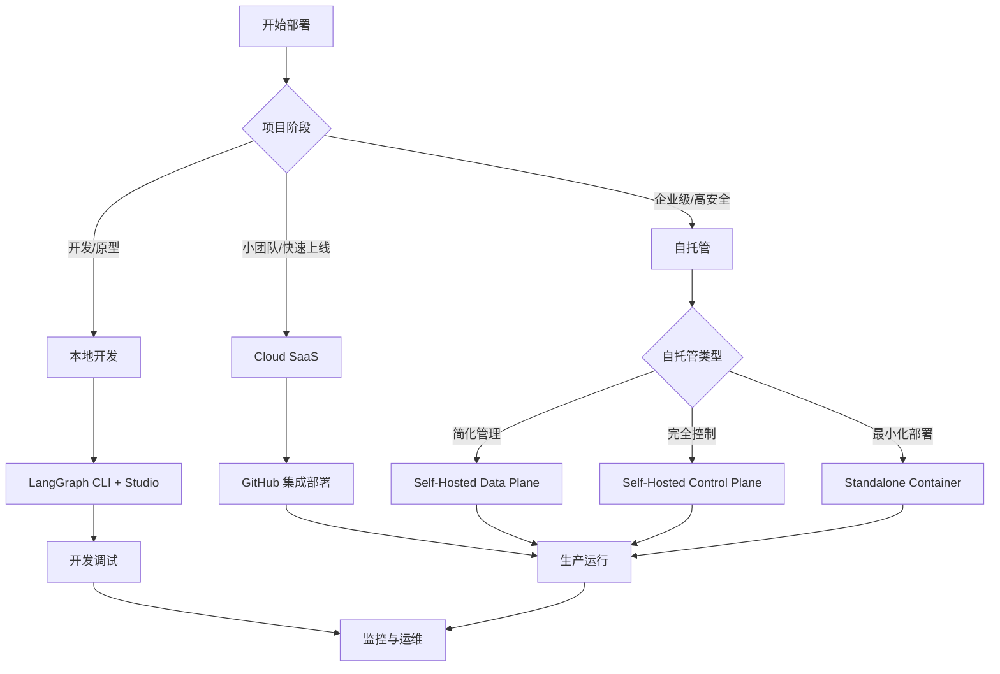

# 07-部署与运维

## 📋 概述

本文件夹提供 LangGraph 应用的完整部署与运维指南，涵盖从本地开发到生产环境的全生命周期管理。通过渐进式学习路径，帮助开发者选择最适合的部署方案并建立可靠的运维体系。

## 🗂 文档结构

### 核心部署方案
1. **[01-本地开发](./01-本地开发.md)** - LangGraph CLI & Studio 开发环境
2. **[02-云部署](./02-云部署.md)** - Cloud SaaS 托管服务
3. **[03-自托管](./03-自托管.md)** - 私有化部署选项

### 运维管理
4. **[04-监控与追踪](./04-监控与追踪.md)** - LangSmith 集成与系统监控
5. **[05-扩展性与韧性](./05-扩展性与韧性.md)** - 高可用架构设计

### 技术专题
6. **[06-Docker容器化](./06-Docker容器化.md)** - 容器化部署方案
7. **[07-认证与授权](./07-认证与授权.md)** - 企业级安全控制
8. **[08-Webhooks集成](./08-Webhooks集成.md)** - 事件驱动架构

## 🚀 快速开始

### 选择部署方案



### 部署决策树

| 需求场景 | 推荐方案 | 关键特性 |
|----------|----------|----------|
| **快速原型开发** | 本地开发 | CLI工具、热重载、Studio调试 |
| **小型团队项目** | Cloud SaaS | 零运维、自动扩展、内置监控 |
| **企业级应用** | Self-Hosted | 数据安全、自主控制、合规要求 |
| **容器化环境** | Docker/K8s | 标准化部署、微服务架构 |
| **高安全要求** | 自托管+认证 | 多租户、RBAC、数据隔离 |

## 📚 学习路径

### 🔰 初学者路径（1-2周）
```
本地开发 → Cloud SaaS → 监控与追踪
    ↓           ↓           ↓
 CLI使用    快速部署    LangSmith集成
```

**目标**：掌握基础开发和部署流程
- ✅ 搭建本地开发环境
- ✅ 完成首次云端部署
- ✅ 配置基础监控

### 🔧 进阶开发者路径（2-3周）
```
容器化 → 自托管 → 扩展性与韧性
    ↓       ↓         ↓
 Docker   K8s部署   高可用设计
```

**目标**：构建生产级部署方案
- ✅ 掌握容器化部署
- ✅ 实现自托管环境
- ✅ 设计高可用架构

### 🏢 企业架构师路径（3-4周）
```
认证与授权 → Webhooks集成 → 完整运维体系
     ↓           ↓             ↓
   RBAC       事件驱动      监控+安全+扩展
```

**目标**：建立企业级运维体系
- ✅ 实现多租户安全
- ✅ 集成外部系统
- ✅ 建立完整监控

## 🛠 部署方案对比

### 功能特性对比

| 特性 | 本地开发 | Cloud SaaS | Self-Hosted Data Plane | Self-Hosted Control Plane | Standalone Container |
|------|----------|------------|-------------------------|----------------------------|---------------------|
| **部署难度** | 🟢 简单 | 🟢 简单 | 🟡 中等 | 🔴 复杂 | 🟡 中等 |
| **运维负担** | 🟢 无 | 🟢 无 | 🟡 中等 | 🔴 高 | 🟡 中等 |
| **数据控制** | 🟢 完全 | 🔴 托管 | 🟢 完全 | 🟢 完全 | 🟢 完全 |
| **扩展性** | 🔴 有限 | 🟢 自动 | 🟢 自定义 | 🟢 自定义 | 🟡 手动 |
| **成本** | 🟢 免费 | 🟡 按量 | 🟡 基础设施 | 🔴 完整成本 | 🟢 低 |
| **安全性** | 🟡 基础 | 🟢 企业级 | 🟢 自控 | 🟢 完全自控 | 🟡 可配置 |

### 适用场景

#### 🏠 本地开发
```yaml
适用场景:
  - 功能开发和测试
  - 原型验证
  - 学习和实验

优势:
  - 快速启动
  - 完整调试工具
  - 零成本

局限:
  - 无生产可用性
  - 单机性能限制
```

#### ☁️ Cloud SaaS
```yaml
适用场景:
  - 快速上线
  - 中小型应用
  - 专注业务逻辑

优势:
  - 零运维
  - 自动扩展
  - 企业级可靠性

局限:
  - 数据托管
  - 定制化限制
  - 成本随用量增长
```

#### 🏢 Self-Hosted Data Plane
```yaml
适用场景:
  - 数据敏感应用
  - 合规要求
  - 成本优化

优势:
  - 数据完全控制
  - 简化管理
  - 成本可控

局限:
  - 需要基础设施
  - 运维责任
```

#### 🔒 Self-Hosted Control Plane
```yaml
适用场景:
  - 最高安全要求
  - 完全自主控制
  - 大型企业

优势:
  - 完全自主
  - 最高安全性
  - 无供应商锁定

局限:
  - 高复杂度
  - 完整运维责任
  - 高成本
```

#### 📦 Standalone Container
```yaml
适用场景:
  - 简单部署
  - 资源受限环境
  - 边缘计算

优势:
  - 部署简单
  - 资源占用小
  - 高度可移植

局限:
  - 功能有限
  - 扩展性较差
  - 需要外部依赖
```

## 🔧 技术栈选择

### 容器化技术
```yaml
Docker:
  - 应用容器化
  - 本地开发环境一致性
  - 简化部署流程

Kubernetes:
  - 生产级编排
  - 自动扩展
  - 服务发现和负载均衡

Docker Compose:
  - 多服务本地开发
  - 简单部署方案
  - 快速环境搭建
```

### 监控技术栈
```yaml
LangSmith:
  - Agent执行追踪
  - 性能分析
  - 调试工具

Prometheus + Grafana:
  - 系统指标监控
  - 可视化仪表板
  - 告警管理

ELK Stack:
  - 日志收集和分析
  - 全文搜索
  - 日志可视化
```

### 安全技术
```yaml
认证方案:
  - JWT Token
  - OAuth2 集成
  - API Key 管理

授权模型:
  - RBAC (基于角色)
  - 多租户隔离
  - 资源级权限

网络安全:
  - HTTPS/TLS
  - 防火墙规则
  - 速率限制
```

## 🚦 部署检查清单

### 部署前准备
- [ ] 确定部署方案和技术栈
- [ ] 准备基础设施和依赖服务
- [ ] 配置环境变量和密钥
- [ ] 设置域名和SSL证书
- [ ] 准备监控和日志系统

### 部署执行
- [ ] 构建和测试应用镜像
- [ ] 配置负载均衡和反向代理
- [ ] 部署应用和依赖服务
- [ ] 验证服务健康状态
- [ ] 配置自动扩展策略

### 部署后验证
- [ ] 功能测试和性能验证
- [ ] 监控和告警配置
- [ ] 备份和恢复流程
- [ ] 安全扫描和漏洞检查
- [ ] 文档更新和团队培训

## ⚡ 性能优化建议

### 应用层优化
```python
# 连接池配置
DATABASE_POOL_SIZE = 20
REDIS_POOL_SIZE = 10

# 缓存策略
CACHE_TTL = 3600
ENABLE_LOCAL_CACHE = True

# 批处理优化
BATCH_SIZE = 100
ASYNC_PROCESSING = True
```

### 基础设施优化
```yaml
# Kubernetes资源配置
resources:
  requests:
    memory: "512Mi"
    cpu: "250m"
  limits:
    memory: "1Gi"
    cpu: "500m"

# 自动扩展配置
autoscaling:
  minReplicas: 2
  maxReplicas: 10
  targetCPUUtilization: 70
```

### 数据库优化
```sql
-- 索引优化
CREATE INDEX CONCURRENTLY idx_threads_user_id ON threads(user_id);
CREATE INDEX CONCURRENTLY idx_checkpoints_thread_id ON checkpoints(thread_id);

-- 连接池配置
max_connections = 100
shared_buffers = 256MB
effective_cache_size = 1GB
```

## 🔍 故障排除指南

### 常见问题分类

#### 部署问题
```bash
# 容器启动失败
docker logs <container_id>
kubectl describe pod <pod_name>

# 网络连接问题
curl -v http://service-url/health
nslookup service-name

# 权限问题
kubectl auth can-i create pods
chmod +x deployment-script.sh
```

#### 性能问题
```bash
# 资源使用分析
kubectl top pods
docker stats
htop

# 数据库性能
EXPLAIN ANALYZE SELECT ...
pg_stat_activity

# 网络延迟
ping target-host
traceroute target-host
```

#### 安全问题
```bash
# SSL证书检查
openssl s_client -connect domain:443

# 权限审计
kubectl get rolebindings
grep "SECURITY" application.log

# 漏洞扫描
trivy image your-image:tag
```

## 📊 监控指标

### 关键业务指标 (KPI)
- **Agent执行成功率**: > 95%
- **平均响应时间**: < 2秒
- **系统可用性**: > 99.9%
- **错误率**: < 1%

### 系统资源指标
- **CPU使用率**: < 70%
- **内存使用率**: < 80%
- **磁盘I/O**: < 80%
- **网络带宽**: < 80%

### 应用特定指标
- **活跃用户数**
- **Agent调用频率**
- **Token使用量**
- **缓存命中率**

## 🛡 安全最佳实践

### 数据保护
- 🔒 所有敏感数据加密存储
- 🔑 定期轮换API密钥和证书
- 🚫 永不在代码中硬编码密钥
- 📝 记录所有访问和操作日志

### 网络安全
- 🌐 使用HTTPS进行所有通信
- 🔥 配置适当的防火墙规则
- 🚦 实施速率限制和DDoS防护
- 🕳 定期进行安全扫描和漏洞评估

### 访问控制
- 👤 实施最小权限原则
- 🎭 使用多因素认证
- 📋 定期审计用户权限
- 🚪 建立完善的身份管理流程

## 📈 扩展策略

### 水平扩展
```yaml
# 应用层扩展
replicas: 3-10 (根据负载)
autoscaling: 基于CPU/内存/请求量

# 数据层扩展
read_replicas: 2-3个只读副本
connection_pooling: 连接池优化
caching: Redis集群
```

### 垂直扩展
```yaml
# 资源配置升级
cpu: 2-4 cores
memory: 4-8 GB
storage: SSD存储

# 网络优化
bandwidth: 1-10 Gbps
latency: < 10ms
```

### 地理分布
```yaml
# 多区域部署
regions: [us-east-1, us-west-2, eu-west-1]
cdn: CloudFlare/AWS CloudFront
dns: 地理位置路由
```

## 🔄 CI/CD 集成

### GitHub Actions 示例
```yaml
name: Deploy LangGraph App
on:
  push:
    branches: [main]

jobs:
  deploy:
    runs-on: ubuntu-latest
    steps:
      - uses: actions/checkout@v3
      - name: Build and Deploy
        run: |
          docker build -t my-app .
          kubectl apply -f k8s/
```

### GitLab CI 示例
```yaml
stages:
  - build
  - test
  - deploy

deploy:
  stage: deploy
  script:
    - helm upgrade --install my-app ./charts/
  only:
    - main
```

## 📞 获取帮助

### 官方资源
- 📖 [LangGraph 官方文档](https://langchain-ai.github.io/langgraph/)
- 💬 [社区论坛](https://community.langchain.com/)
- 🐛 [问题报告](https://github.com/langchain-ai/langgraph/issues)

### 学习资源
- 🎥 [视频教程](https://www.youtube.com/LangChain)
- 📚 [示例项目](https://github.com/langchain-ai/langgraph/tree/main/examples)
- 🏗 [模板应用](https://github.com/langchain-ai/langgraph-templates)

### 社区支持
- 💬 [Discord 社区](https://discord.gg/langchain)
- 🐦 [Twitter 更新](https://twitter.com/langchainai)
- 📧 [邮件列表](https://langchain.com/newsletter)

---

## 🎯 下一步行动

1. **选择合适的部署方案** - 根据需求选择最适合的部署选项
2. **搭建开发环境** - 从本地开发开始，熟悉工具和流程
3. **实施监控体系** - 建立完整的可观测性
4. **配置安全措施** - 确保生产环境安全
5. **优化性能** - 持续改进系统性能和用户体验

**开始你的 LangGraph 部署之旅！** 🚀