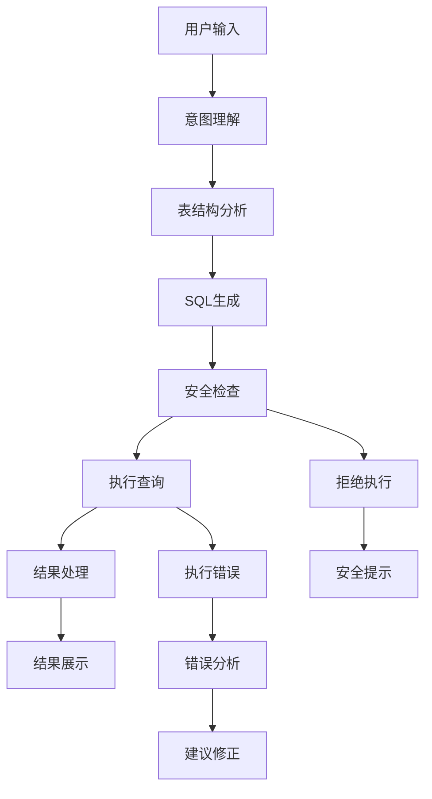

# SQL智能助手项目案例

> 🎯 **项目目标**：构建一个能够理解自然语言并转换为SQL查询的智能助手

## 📋 项目概述

这个SQL智能助手展示了如何使用LangGraph构建一个安全、可靠的数据库查询系统。项目包含完整的自然语言到SQL的转换流程，支持多种数据库类型，并内置了安全防护机制。

## 🏗️ 项目结构

```
02-SQL智能助手/
├── README.md                    # 项目说明
├── sql_agent.py                # 主程序
├── database_setup.py           # 数据库初始化
├── example_queries.sql         # 示例SQL查询
├── requirements.txt            # 依赖列表
├── config/
│   ├── database_config.py      # 数据库配置
│   ├── prompts.py              # 提示词模板
│   └── security_rules.py       # 安全规则
├── data/
│   ├── sample_database.db      # 示例SQLite数据库
│   └── sample_data.csv         # 示例数据
└── tests/
    ├── test_sql_agent.py       # 单元测试
    └── test_security.py        # 安全测试
```

## 🎯 学习目标

通过这个项目，你将学会：

1. **自然语言处理**：理解用户的查询意图
2. **SQL生成**：安全地生成SQL查询语句
3. **数据库操作**：连接和查询多种数据库
4. **安全防护**：防止SQL注入和恶意查询
5. **结果展示**：格式化和可视化查询结果
6. **错误处理**：优雅处理SQL错误和异常

## 🚀 快速开始

### 前置条件

- ✅ 完成 `03-LangGraph基础/` 学习
- ✅ 基本的SQL语法知识
- ✅ 数据库基础概念

### 安装依赖

```bash
cd Foundations/08-项目案例/02-SQL智能助手/
pip install -r requirements.txt
```

### 初始化数据库

```bash
python database_setup.py
```

### 运行智能助手

```bash
# 设置API密钥
export OPENAI_API_KEY="your-api-key"

# 运行助手
python sql_agent.py
```

## 📊 功能特性

### 核心功能

| 功能 | 描述 | 示例 |
|------|------|------|
| 自然语言查询 | 支持中英文查询 | "查询销售额最高的5个产品" |
| 多表关联 | 智能处理表间关系 | "显示每个客户的订单总数" |
| 聚合统计 | 支持各种统计函数 | "计算平均订单金额" |
| 时间范围 | 支持时间筛选 | "查询上个月的销售数据" |
| 结果解释 | 解释查询结果含义 | 自动生成业务洞察 |

### 安全特性

- ✅ SQL注入防护
- ✅ 只读权限控制
- ✅ 敏感表保护
- ✅ 查询复杂度限制
- ✅ 结果行数限制

### 高级特性

- ✅ 查询优化建议
- ✅ 执行计划分析
- ✅ 查询历史记录
- ✅ 数据可视化
- ✅ 导出功能

## 🔧 技术架构



## 📚 核心组件解析

### 1. 自然语言理解

```python
class QueryUnderstanding:
    """查询理解组件"""

    def parse_intent(self, user_query: str) -> QueryIntent:
        """解析用户查询意图"""
        # 识别查询类型：SELECT, COUNT, SUM, AVG等
        # 提取关键实体：表名、字段名、条件等
        # 确定查询范围：时间、数量限制等
```

### 2. 表结构分析

```python
class SchemaAnalyzer:
    """数据库结构分析器"""

    def get_relevant_tables(self, query_intent: QueryIntent) -> List[Table]:
        """获取相关表结构"""
        # 分析查询涉及的表
        # 获取表的字段信息
        # 分析表间关系
```

### 3. SQL生成器

```python
class SQLGenerator:
    """SQL生成器"""

    def generate_sql(self, intent: QueryIntent, schema: List[Table]) -> str:
        """生成SQL查询"""
        # 构建SELECT子句
        # 处理JOIN关系
        # 添加WHERE条件
        # 处理排序和分组
```

## 🛡️ 安全机制

### 1. 输入验证

```python
# 关键词黑名单
DANGEROUS_KEYWORDS = [
    'DROP', 'DELETE', 'INSERT', 'UPDATE', 'CREATE', 'ALTER',
    'EXEC', 'EXECUTE', 'DECLARE', 'TRUNCATE'
]

# 表名白名单
ALLOWED_TABLES = [
    'products', 'customers', 'orders', 'order_items'
]
```

### 2. 查询限制

```python
# 结果行数限制
MAX_RESULT_ROWS = 1000

# 查询复杂度限制
MAX_JOIN_COUNT = 5
MAX_WHERE_CONDITIONS = 10
```

## 🎪 使用示例

### 基础查询

```
用户: "显示所有产品的名称和价格"
助手:
SQL: SELECT name, price FROM products;
结果: [产品列表表格]
解释: 查询返回了所有产品的基本信息，共X个产品。
```

### 复杂查询

```
用户: "查询每个客户在2023年的订单总金额，按金额降序排列"
助手:
SQL: SELECT c.name, SUM(oi.quantity * oi.price) as total_amount
     FROM customers c
     JOIN orders o ON c.id = o.customer_id
     JOIN order_items oi ON o.id = oi.order_id
     WHERE YEAR(o.order_date) = 2023
     GROUP BY c.id, c.name
     ORDER BY total_amount DESC;
结果: [客户销售排行榜]
解释: 2023年销售额最高的客户是XXX，总计XXX元。
```

### 错误处理

```
用户: "删除所有订单数据"
助手: ❌ 安全检查失败
原因: 检测到危险操作（DELETE），系统只支持查询操作。
建议: 请使用SELECT语句进行数据查询。
```

## 🚧 常见问题

### Q: 如何添加新的数据源？

A: 在 `database_config.py` 中添加新的数据库连接配置，并更新表结构信息。

### Q: 如何处理复杂的业务逻辑？

A: 可以预定义常用的业务查询模板，在意图识别时匹配对应模板。

### Q: 如何优化查询性能？

A: 系统会分析查询计划并提供优化建议，包括索引推荐和查询重写。

## 🎯 练习建议

### 初级练习

1. **添加新表**：在示例数据库中添加"供应商"表
2. **扩展查询类型**：支持HAVING子句的查询
3. **改进错误提示**：提供更友好的错误信息

### 中级练习

1. **可视化集成**：添加图表生成功能
2. **查询优化**：实现查询性能分析
3. **多数据库支持**：支持MySQL、PostgreSQL

### 高级练习

1. **语义搜索**：使用向量搜索增强表字段匹配
2. **智能推荐**：基于查询历史推荐相关查询
3. **实时监控**：添加查询性能监控仪表板

## 📈 扩展方向

### 1. 商业智能集成

- 连接现有BI工具
- 自动生成报表
- 数据仓库支持

### 2. 协作功能

- 查询分享机制
- 团队查询库
- 权限管理系统

### 3. 机器学习增强

- 查询意图预测
- 异常数据检测
- 自动化洞察生成

## 🎉 完成标志

当你能够：

- ✅ 理解自然语言到SQL的转换流程
- ✅ 实现安全的数据库查询机制
- ✅ 处理复杂的多表关联查询
- ✅ 提供有意义的查询结果解释
- ✅ 优雅处理各种错误情况

恭喜！你已经掌握了构建SQL智能助手的核心技能！

## 🚀 下一步

完成SQL智能助手后，可以继续学习：
- `03-多Agent系统/` - 团队协作的Agent架构
- `04-RAG应用/` - 知识增强的检索系统

---

*通过这个项目，你将学会如何安全、高效地构建数据查询助手！* 🚀