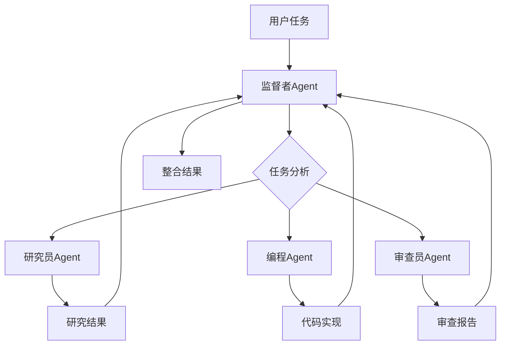
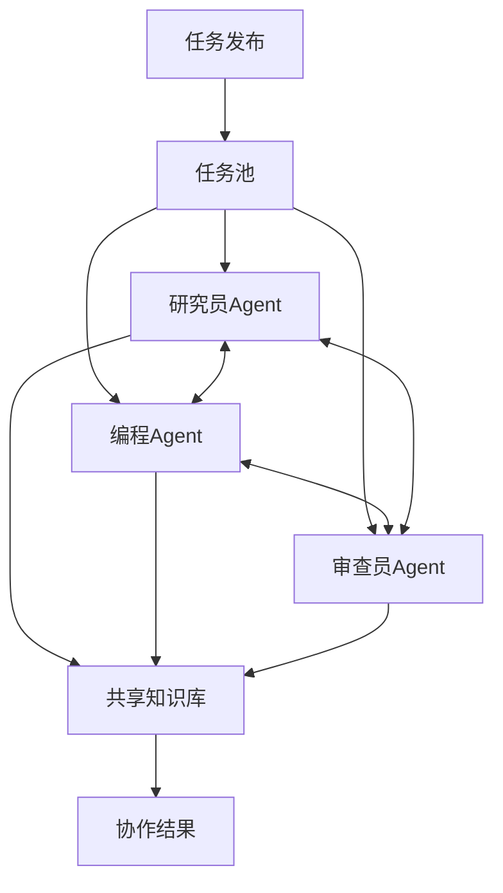

# 多Agent系统项目案例

> 🎯 **项目目标**：构建协作的多Agent系统，展示Agent间的通信、任务分配和协同工作

## 📋 项目概述

这个项目展示了如何使用LangGraph构建复杂的多Agent系统。包含两种经典架构模式：监督者模式（Supervisor）和群体智能模式（Swarm），以及三个专业化的Agent：研究员、编程助手和代码审查员。

## 🏗️ 项目结构

```
03-多Agent系统/
├── README.md                    # 项目说明
├── supervisor.py               # 监督者模式实现
├── swarm.py                    # 群体智能模式实现
├── requirements.txt            # 依赖列表
├── agents/
│   ├── __init__.py            # Agent包初始化
│   ├── base_agent.py          # Agent基类
│   ├── researcher.py          # 研究员Agent
│   ├── coder.py               # 编程助手Agent
│   ├── reviewer.py            # 代码审查员Agent
│   └── coordinator.py         # 协调器Agent
├── config/
│   ├── agent_config.py        # Agent配置
│   ├── prompts.py             # 提示词模板
│   └── communication.py      # 通信协议
├── utils/
│   ├── message_types.py       # 消息类型定义
│   ├── task_queue.py          # 任务队列管理
│   └── metrics.py            # 性能指标
└── examples/
    ├── research_task.py       # 研究任务示例
    ├── coding_task.py         # 编程任务示例
    └── review_workflow.py     # 审查流程示例
```

## 🎯 学习目标

通过这个项目，你将学会：

1. **多Agent架构设计**：理解不同的协作模式
2. **Agent间通信**：消息传递和状态同步
3. **任务分解与分配**：复杂任务的分解策略
4. **协作流程设计**：工作流程的编排
5. **错误处理与恢复**：分布式系统的容错机制
6. **性能监控**：多Agent系统的性能优化

## 🚀 快速开始

### 前置条件

- ✅ 完成 `01-聊天机器人/` 学习
- ✅ 理解Agent的基本概念
- ✅ 熟悉异步编程

### 安装依赖

```bash
cd Foundations/08-项目案例/03-多Agent系统/
pip install -r requirements.txt
```

### 运行监督者模式

```bash
# 设置API密钥
export OPENAI_API_KEY="your-api-key"

# 运行监督者模式
python supervisor.py
```

### 运行群体智能模式

```bash
python swarm.py
```

## 📊 系统架构

### 1. 监督者模式 (Supervisor Pattern)



**特点**：
- 中央协调器统一管理
- 清晰的任务分配机制
- 严格的工作流控制
- 便于监控和调试

### 2. 群体智能模式 (Swarm Pattern)



**特点**：
- 去中心化的协作模式
- Agent间自主通信
- 动态任务认领机制
- 更强的容错能力

## 🤖 Agent介绍

### 1. 研究员Agent (Researcher)

**职责**：
- 信息收集和分析
- 技术调研和方案设计
- 市场研究和竞品分析

**技能**：
- 网络搜索
- 文档分析
- 数据整理
- 报告生成

### 2. 编程助手Agent (Coder)

**职责**：
- 代码设计和实现
- 技术选型和架构设计
- 代码优化和重构

**技能**：
- 多语言编程
- 框架使用
- 算法实现
- 测试编写

### 3. 代码审查员Agent (Reviewer)

**职责**：
- 代码质量审查
- 安全性检查
- 性能优化建议
- 最佳实践指导

**技能**：
- 静态代码分析
- 安全漏洞检测
- 性能瓶颈识别
- 代码规范检查

## 📝 使用示例

### 监督者模式示例

```python
from supervisor import SupervisorSystem

# 创建监督者系统
system = SupervisorSystem()

# 执行复杂任务
task = {
    "type": "product_development",
    "description": "设计并实现一个待办事项管理应用",
    "requirements": [
        "用户注册登录功能",
        "任务增删改查",
        "任务分类和标签",
        "提醒通知功能"
    ]
}

result = await system.execute_task(task)
print(f"任务完成：{result}")
```

### 群体智能模式示例

```python
from swarm import SwarmSystem

# 创建群体智能系统
swarm = SwarmSystem()

# 发布任务到任务池
tasks = [
    {"type": "research", "topic": "React Native vs Flutter"},
    {"type": "coding", "feature": "用户认证模块"},
    {"type": "review", "code_path": "./src/auth.py"}
]

# Agent自主认领和执行任务
results = await swarm.process_tasks(tasks)
```

## 🔄 工作流程

### 产品开发流程

1. **需求分析阶段**
   - 研究员Agent收集用户需求
   - 分析竞品和技术方案
   - 生成需求文档

2. **设计开发阶段**
   - 编程Agent设计系统架构
   - 实现核心功能模块
   - 编写单元测试

3. **质量保证阶段**
   - 审查员Agent检查代码质量
   - 进行安全性和性能审查
   - 提供优化建议

4. **整合交付阶段**
   - 监督者Agent整合所有成果
   - 生成最终交付物
   - 评估项目完成度

## 🛡️ 通信协议

### 消息类型

```python
class MessageType(Enum):
    TASK_ASSIGNMENT = "task_assignment"
    PROGRESS_UPDATE = "progress_update"
    RESULT_SUBMISSION = "result_submission"
    COLLABORATION_REQUEST = "collaboration_request"
    ERROR_REPORT = "error_report"
    RESOURCE_SHARING = "resource_sharing"
```

### 消息格式

```python
@dataclass
class AgentMessage:
    sender: str
    receiver: str
    message_type: MessageType
    content: Dict[str, Any]
    timestamp: datetime
    priority: int = 1
    correlation_id: Optional[str] = None
```

## 📈 性能监控

### 关键指标

- **任务完成率**：成功完成的任务比例
- **平均响应时间**：Agent响应任务的平均时间
- **协作效率**：Agent间协作的效率指标
- **资源利用率**：系统资源的使用情况
- **错误率**：任务执行失败的比例

### 监控面板

```python
# 实时性能指标
metrics = system.get_metrics()
print(f"活跃Agent数量: {metrics.active_agents}")
print(f"待处理任务: {metrics.pending_tasks}")
print(f"平均处理时间: {metrics.avg_processing_time}秒")
print(f"成功率: {metrics.success_rate}%")
```

## 🔧 配置选项

### Agent配置

```python
agent_config = {
    "researcher": {
        "max_concurrent_tasks": 3,
        "search_timeout": 30,
        "cache_results": True
    },
    "coder": {
        "supported_languages": ["python", "javascript", "java"],
        "code_style": "pep8",
        "test_coverage_threshold": 80
    },
    "reviewer": {
        "severity_levels": ["low", "medium", "high", "critical"],
        "auto_fix_enabled": True,
        "performance_checks": True
    }
}
```

### 系统配置

```python
system_config = {
    "max_agents": 10,
    "task_timeout": 300,
    "retry_attempts": 3,
    "enable_logging": True,
    "log_level": "INFO"
}
```

## 🚧 常见问题

### Q: Agent之间如何避免重复工作？

A: 通过任务分配算法和状态同步机制，确保每个任务只分配给一个Agent。

### Q: 如何处理Agent失效的情况？

A: 实现健康检查机制，失效的Agent会被移除，其任务会重新分配给其他Agent。

### Q: 如何优化多Agent系统的性能？

A: 通过负载均衡、任务优先级排序、缓存机制等方式优化性能。

## 🎯 练习建议

### 初级练习

1. **扩展Agent类型**：添加一个测试工程师Agent
2. **自定义消息类型**：添加新的通信消息类型
3. **简单任务流程**：实现一个简单的任务执行流程

### 中级练习

1. **动态Agent管理**：实现Agent的动态添加和移除
2. **任务优先级**：添加任务优先级和调度算法
3. **结果缓存**：实现智能缓存机制避免重复工作

### 高级练习

1. **容错机制**：实现完整的容错和恢复机制
2. **负载均衡**：动态调整Agent的工作负载
3. **分布式部署**：支持Agent在不同机器上运行

## 🎉 完成标志

当你能够：

- ✅ 理解多Agent系统的架构模式
- ✅ 实现Agent间的有效通信
- ✅ 设计复杂的协作工作流
- ✅ 处理并发和错误情况
- ✅ 监控和优化系统性能

恭喜！你已经掌握了构建复杂多Agent系统的能力！

## 🚀 下一步

完成多Agent系统后，可以继续学习：
- `04-RAG应用/` - 知识增强检索系统
- 或者尝试将多Agent系统部署到生产环境

---

*通过这个项目，你将学会如何构建真正智能的协作系统！* 🚀