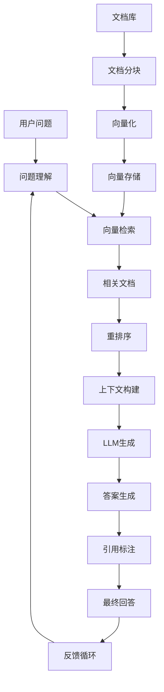

# RAG应用系统项目案例

> 🎯 **项目目标**：构建检索增强生成（RAG）系统，结合知识库检索和大语言模型生成

## 📋 项目概述

这个RAG应用展示了如何使用LangGraph构建智能的知识问答系统。系统通过向量检索技术从知识库中找到相关信息，然后结合大语言模型生成准确、有根据的回答。

## 🏗️ 项目结构

```
04-RAG应用/
├── README.md                    # 项目说明
├── rag_system.py               # 主RAG系统
├── document_loader.py          # 文档加载器
├── vector_store.py             # 向量存储管理
├── requirements.txt            # 依赖列表
├── config/
│   ├── rag_config.py          # RAG配置
│   ├── embedding_config.py     # 嵌入模型配置
│   └── retrieval_prompts.py    # 检索提示词
├── data/
│   ├── sample_docs.md         # 示例文档
│   ├── knowledge_base/        # 知识库文档
│   └── vector_db/            # 向量数据库文件
├── utils/
│   ├── text_processing.py     # 文本处理工具
│   ├── chunk_strategies.py    # 分块策略
│   └── retrieval_metrics.py   # 检索指标
└── examples/
    ├── simple_qa.py          # 简单问答示例
    ├── document_chat.py      # 文档对话示例
    └── batch_processing.py   # 批量处理示例
```

## 🎯 学习目标

通过这个项目，你将学会：

1. **文档处理**：文档加载、分块和预处理
2. **向量化技术**：文本嵌入和向量存储
3. **相似度检索**：基于语义的信息检索
4. **上下文生成**：结合检索结果生成回答
5. **引用追踪**：回答来源的可追溯性
6. **检索优化**：提升检索质量和效率

## 🚀 快速开始

### 前置条件

- ✅ 完成前面的项目学习
- ✅ 理解向量数据库概念
- ✅ 基本的NLP知识

### 安装依赖

```bash
cd Foundations/08-项目案例/04-RAG应用/
pip install -r requirements.txt
```

### 初始化知识库

```bash
# 加载示例文档到向量数据库
python document_loader.py --init

# 验证向量数据库
python vector_store.py --verify
```

### 运行RAG系统

```bash
# 设置API密钥
export OPENAI_API_KEY="your-api-key"

# 启动RAG系统
python rag_system.py
```

## 📊 系统架构



## 🔧 核心组件

### 1. 文档加载器 (Document Loader)

**功能**：
- 支持多种文档格式（PDF、Word、Markdown、TXT）
- 智能文档分块
- 元数据提取
- 重复内容检测

**示例**：
```python
from document_loader import DocumentLoader

loader = DocumentLoader()
documents = loader.load_directory("./data/knowledge_base/")
chunks = loader.chunk_documents(documents, strategy="semantic")
```

### 2. 向量存储 (Vector Store)

**功能**：
- 高效的向量相似度搜索
- 元数据过滤
- 增量更新
- 持久化存储

**示例**：
```python
from vector_store import ChromaVectorStore

vector_store = ChromaVectorStore()
vector_store.add_documents(chunks)
results = vector_store.similarity_search(query, k=5)
```

### 3. RAG系统 (RAG System)

**功能**：
- 智能查询理解
- 多阶段检索
- 上下文排序
- 生成质量评估

## 📝 使用示例

### 基础问答

```python
from rag_system import RAGSystem

rag = RAGSystem()

# 简单问答
question = "什么是机器学习？"
answer = rag.ask(question)
print(f"问题: {question}")
print(f"回答: {answer.content}")
print(f"来源: {answer.sources}")
```

### 文档对话

```python
# 基于特定文档的对话
rag.load_document("./data/ml_handbook.pdf")

conversation = [
    "解释一下监督学习和无监督学习的区别",
    "深度学习算法有哪些？",
    "如何评估机器学习模型的性能？"
]

for question in conversation:
    answer = rag.ask(question, context_aware=True)
    print(f"Q: {question}")
    print(f"A: {answer.content}\n")
```

### 批量处理

```python
# 批量问答处理
questions = [
    "什么是自然语言处理？",
    "推荐系统是如何工作的？",
    "计算机视觉的主要应用是什么？"
]

results = rag.batch_ask(questions)
for q, a in results:
    print(f"Q: {q}")
    print(f"A: {a.content}")
    print(f"置信度: {a.confidence}")
    print("-" * 50)
```

## 📈 检索策略

### 1. 密集检索 (Dense Retrieval)

```python
# 基于语义相似度的检索
retriever = DenseRetriever(
    embedding_model="text-embedding-ada-002",
    similarity_threshold=0.7,
    max_results=10
)
```

### 2. 混合检索 (Hybrid Retrieval)

```python
# 结合关键词和语义检索
retriever = HybridRetriever(
    dense_weight=0.7,
    sparse_weight=0.3,
    fusion_method="rrf"  # Reciprocal Rank Fusion
)
```

### 3. 重排序 (Re-ranking)

```python
# 检索结果重排序
reranker = CrossEncoderReranker(
    model="ms-marco-MiniLM-L-6-v2",
    top_k=5
)
```

## 🎯 优化技巧

### 1. 分块策略优化

```python
# 语义分块
semantic_chunker = SemanticChunker(
    chunk_size=512,
    overlap_size=50,
    similarity_threshold=0.6
)

# 固定长度分块
fixed_chunker = FixedSizeChunker(
    chunk_size=1000,
    overlap_size=200
)

# 结构化分块
structural_chunker = StructuralChunker(
    respect_sentences=True,
    respect_paragraphs=True
)
```

### 2. 查询增强

```python
# 查询扩展
query_expander = QueryExpander(
    methods=["synonyms", "related_terms", "paraphrasing"]
)

# 查询重写
query_rewriter = QueryRewriter(
    model="gpt-3.5-turbo",
    max_rewrites=3
)
```

### 3. 上下文优化

```python
# 上下文压缩
context_compressor = ContextCompressor(
    max_tokens=2000,
    preservation_strategy="importance_ranking"
)

# 上下文去重
context_deduplicator = ContextDeduplicator(
    similarity_threshold=0.8
)
```

## 📊 评估指标

### 检索质量指标

```python
from utils.retrieval_metrics import RetrievalMetrics

metrics = RetrievalMetrics()

# 计算检索指标
precision = metrics.precision_at_k(retrieved_docs, relevant_docs, k=5)
recall = metrics.recall_at_k(retrieved_docs, relevant_docs, k=5)
f1_score = metrics.f1_score(precision, recall)
mrr = metrics.mean_reciprocal_rank(retrieved_docs, relevant_docs)

print(f"Precision@5: {precision:.3f}")
print(f"Recall@5: {recall:.3f}")
print(f"F1 Score: {f1_score:.3f}")
print(f"MRR: {mrr:.3f}")
```

### 生成质量指标

```python
from utils.generation_metrics import GenerationMetrics

gen_metrics = GenerationMetrics()

# 计算生成指标
bleu_score = gen_metrics.bleu_score(generated_answer, reference_answer)
rouge_score = gen_metrics.rouge_score(generated_answer, reference_answer)
bertscore = gen_metrics.bert_score(generated_answer, reference_answer)

print(f"BLEU Score: {bleu_score:.3f}")
print(f"ROUGE-L: {rouge_score['rouge-l']:.3f}")
print(f"BERTScore F1: {bertscore['f1']:.3f}")
```

## 🛡️ 质量控制

### 1. 答案验证

```python
class AnswerValidator:
    def validate_answer(self, question, answer, sources):
        checks = {
            "relevance": self.check_relevance(question, answer),
            "consistency": self.check_consistency(answer, sources),
            "completeness": self.check_completeness(question, answer),
            "factuality": self.check_factuality(answer)
        }
        return checks
```

### 2. 引用准确性

```python
class CitationValidator:
    def validate_citations(self, answer, sources):
        citations = self.extract_citations(answer)
        accuracy_scores = []

        for citation in citations:
            score = self.verify_citation(citation, sources)
            accuracy_scores.append(score)

        return {
            "citation_accuracy": np.mean(accuracy_scores),
            "citation_coverage": len(citations) / len(sources)
        }
```

## 🔄 实时更新

### 增量索引

```python
# 增量添加文档
def add_documents_incrementally(new_documents):
    processed_docs = document_processor.process(new_documents)
    embeddings = embedding_model.embed_documents(processed_docs)
    vector_store.add_embeddings(embeddings, processed_docs)

    # 更新索引
    vector_store.update_index()
```

### 在线学习

```python
# 基于用户反馈优化
def update_from_feedback(question, answer, feedback):
    if feedback == "helpful":
        # 增强相关文档的权重
        enhancer.boost_relevant_docs(question, answer.sources)
    elif feedback == "not_helpful":
        # 降低相关文档的权重
        enhancer.demote_irrelevant_docs(question, answer.sources)
```

## 📱 Web界面

### Streamlit界面

```python
import streamlit as st
from rag_system import RAGSystem

st.title("智能知识问答系统")

# 初始化RAG系统
if 'rag' not in st.session_state:
    st.session_state.rag = RAGSystem()

# 问题输入
question = st.text_input("请输入您的问题：")

if st.button("提问"):
    with st.spinner("正在思考..."):
        answer = st.session_state.rag.ask(question)

        st.write("### 回答")
        st.write(answer.content)

        st.write("### 参考来源")
        for i, source in enumerate(answer.sources, 1):
            st.write(f"{i}. {source.title} (相似度: {source.similarity:.3f})")
```

## 🚧 常见问题

### Q: 如何提高检索准确性？

A: 可以通过以下方法：
1. 优化文档分块策略
2. 使用更好的嵌入模型
3. 实施查询增强技术
4. 添加重排序机制

### Q: 如何处理多语言文档？

A: 使用多语言嵌入模型，或者为不同语言分别建立索引。

### Q: 如何保证答案的时效性？

A: 实施增量更新机制，定期刷新知识库，标记文档的时间戳。

## 🎯 练习建议

### 初级练习

1. **扩展文档格式**：支持更多文档格式（Excel、PowerPoint）
2. **改进分块**：实现更智能的文档分块策略
3. **添加过滤**：基于元数据的文档过滤功能

### 中级练习

1. **多模态RAG**：支持图片和表格的检索
2. **对话历史**：实现多轮对话的上下文管理
3. **个性化**：基于用户偏好的个性化检索

### 高级练习

1. **分布式部署**：支持大规模分布式检索
2. **实时更新**：实现文档的实时索引更新
3. **强化学习**：基于用户反馈的检索优化

## 🎉 完成标志

当你能够：

- ✅ 构建完整的RAG系统流程
- ✅ 实现高质量的文档检索
- ✅ 生成准确且有依据的回答
- ✅ 优化检索和生成性能
- ✅ 处理复杂的知识问答场景

恭喜！你已经掌握了构建生产级RAG系统的能力！

## 🚀 下一步

完成RAG应用后，你可以：
- 探索更高级的RAG技术（GraphRAG、Multi-hop RAG）
- 集成到现有的应用系统中
- 部署到生产环境并进行性能监控

---

*通过这个项目，你将学会如何构建智能的知识问答系统！* 🚀